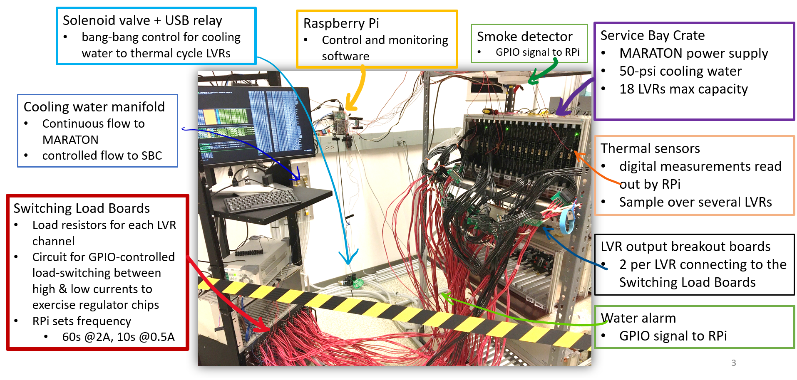
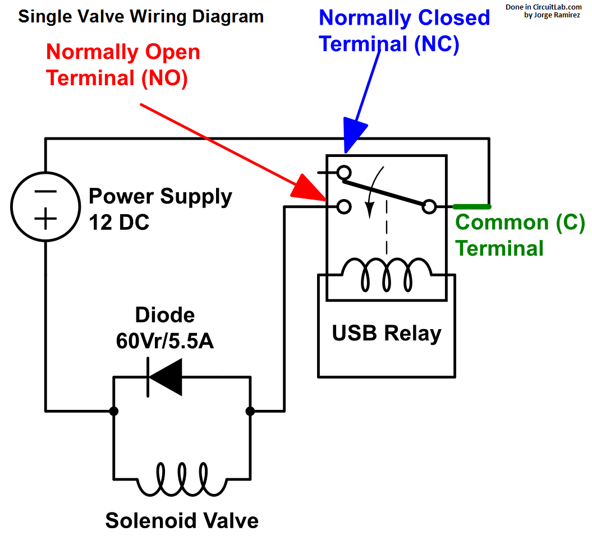

# Intro
The "burn-in" stage of testing is to ensure that the LVRs can be used in the
final system at CERN. The burn-in uses both hardware and software which were
designed at UMD.

The burn-in testing makes extensive use of the software in the repo
`NeoBurnIn`. This repo also imports software from repo `rpi.burnin`.


# Hardware Configuration
The hardware system has four major components, the MARATON power supply, the
crate containing the LVRs, the crate containing the switching load boards,
and a single raspberry pi.

The MARATON power supply is connected to the crate containing the LVRs and
is used to provide power to the separate LVR channels.

The LVRs connect to the crate containing the switching load boards and
have their output connected to the switching load boards.

The switching load boards and the single raspberry pi are the parts of the
hardware configuration that require the most setup so they will each receive
their own section.

A picture of the final hardware configuration is shown below.




## Switching Load Board Setup
The switching load boards are used to increase the current output by the
LVRs. A picture of the board is shown below.


From the picture there are two separate connections which will have pinouts
to other hardware. The two pinouts on the upper left-side of the board
(`P101`) are labeled as `V Opto Sec. 5V`. These pinouts are connected to a
function generator which provides a 5V DC connection to the switching load
board. The positive and negative terminals connect to the respective
positve and negative terminals of the function generator.

The second connection are the two pinouts on the upper right-side of the
board (`P102`) which are labeled as `RPi GPIO Control`. The positive
terminal of this connection connects to one of the many GPIO pins on the
raspberry pi and the negative terminal connects to one the the raspberry pi
pins labeled `GND`. Any GPIO pins that occur on the pi at pins 11 or lower
can not be conencted to the switching load boards as these GPIO pins are
reserved for other hardware. This will be further explained in the section
describing the raspberry pi hardware setup.

Additionally, a python script was made which will pull the GPIO pin
connected to the switching load board high for 60 seconds, then pull
the pin low for 10 seconds and repeat this process until the user
interrupts this process (from Ctrl+C). Pulling the GPIO pin high will
power the switching load board and tell it to increase the current
output by the LVRs. The python script will be described more with the
other software below.

## Raspberry Pi Setup
The single raspberry pi for the hardware is considered the brain of the
system as this pi controls all of the software for the system and controls
the power to the hardware.

The raspberry pi for this system is version RPi 3B+ and has a MicroSD card
configured to run the `NixOS` operating system (linux based). The pi must
be connected to a monitor and keyboard in order to control the system.

**Note:** The grounding for the pi is through the shield of the HDMI cord
connecting the monitor to the pi. This means that the monitor conencted to
the pi **must** have a three-prong power cord to ensure that all GNDs in
the system are referencing the Earth GND.

The raspberry pi controls most of the smaller hardware parts of the system
including the USB relay (used to control the CP100 Rain Bird Solenoid Valve),
the water alarm, the fire alarm and all of the thermistors.

**Note:** The power for the thermistors and the fire alarm both come from
the `3.3V` pin of the pi although there is only one `3.3V` pin. To fix
this we made a wire which starts at the `3.3V` pin of the pi and forks
out to make two connections.

**UPDATE:** There are actually two `3.3V` pins on the raspberry pi, however
the second `3.3V` pin is not near the other power pins. Due to this, we
decided to contiue use of the forked connection as it is best to keep all
power connections in one place.

A picture of all connections to the raspberry pi GPIO pins is shown below.


#### USB Relay and Solenoid Valve
The USB relay and solenoid valve control the water flowing to the LVR crate.
This water is used for cooling the crate if it gets too hot. A diagram of
the circuit is shown below.



The USB relay in this diagram would be connected to the raspberry pi via USB.
Multiple solenoid valves can be inserted into this system although now we
only have one solenoid valve in use as each solenoid valve in the system
requires its own diode and normally open (NO) terminal.

#### Water Alarm
The water alarm is used to measure if water is leaking on the floor next to
the crate containing the LVRs. This would occur if the tubes connected to
the solenoid valve started to leak. If water is detected then the software
will output a `WATER` message. The water alarm is a
[floor water sensor by Level Sense](https://www.amazon.com/Floor-Water-Sensor-Flood-Detection/dp/B079YB1T8J/ref=cm_cr_srp_d_product_top?ie=UTF8 "Water Sensor on Amazon").

The water alarm has a red wire, which is connected to one of the `5V`
connections on the pi, and a white wire, which is connected to pin 11 of
the pi (`GPIO17`) with a pull-down resistor of 4.7k.

#### Fire Alarm
The fire alarm is used to detect if smoke is rising from the crate
containing the LVRs. If smoke is detected then the alarm will trigger
and the software will output a `FIRE` message.

The fire alarm has three connections to the pi. The grey wire from the
alarm will connect to one of the `GND` pins of the pi. The blue wire
from the alarm has two connections with a pull-down resistor
connecting them. The red only wire soldered to the blue wire is the
power for the alarm and is connected to one of the forked `3.3V`
connections. The red wire with black markings soldered to the blue
wire is the control for the alarm and is connected to pin 8
(`GPIO14`) of the pi.

#### Thermistors
The thermistors are used to measure the temperature of the LVRs being
burned-in. The thermistors have their values averaged to obtain the
nominal temperature of the crate.

If the crate has a temperature of 30C or higher then the solenoid
valve is turned to allow water to flow to the crate and aid in cooling
the crate. Once the crate has a temperature of 29C or lower then the
solenoid valve is turned off and water flow stops to ensure that
the crate does not continue to cool.

The thermistors all have their GND legs soldered to their VDD legs
and are connected in parallel to each other via a breakout board
connected to the pi. The breakout board has one rail for the GND
connection of each thermistor and one rail for the data obtained
by the thermistor. A diagram of the circuit is shown below.


The connections to the pins of the pi in the diagram are the same
as the connections to the pins of the pi in use for the burn-in.


# Software
The software for the burn-in is all run through the raspberry pi
and comes from the repo `NeoBurnIn`. Some software also comes
from the `rpi.burnin` repo although the necessary software
from this repo is downloaded from the command shown in the
**Dependencies** section.

In order to run to the burn-in software one must first clone
the `master` branch of the `NeoBurnIn` repo. After cloning,
change directory to the recently cloned `NeoBurnIn` repo and
isuue the command:
```
nix-shell
```

This will setup the evironment for the software to be run
correctly.

## Dependencies
After setting up the environment, the required packages for
the software must be downloaded. All required packages can be
installed with:
```
pip install -U -r ./requirements.txt
```

## Configuration
The configuration of all data logging and hardware is included
in the YAML files for each of the python scripts. These YAML are:
- `NeoBurnIn/DataServer.example.yml`
- `NeoBurnIn/CtrlServer.example.yml`
- `NeoBurnIn/measurements/test_temp_ctrl_client.yml`

`NeoBurnIn/DataServer.example.yml` controls the setup for the
output log file from `DataServer.py`. This YAML file also
controls the standard deviation range to use for the
thermistor readout warning.

`NeoBurnIn/CtrlServer.example.yml` controls the setup for the
output log file from `CtrlServer.py`. This YAML file also
controls the IP address and port number of the raspberry pi
to be used for the `curl` commands which control the USB
relay. Additionally, this YAML file controls the time intervals
on which the USB relay and MARATON power supply can be
controlled. For example, in this file if the variable
`minTimeOut` is set to `60` then this means that the channels
of the USB relay and the MARATON power supply can only be
switched from on to off or vice-versa every 60 seconds.

`NeoBurnIn/measurements/test_temp_ctrl_client.yml` controls
the setup for the output log file from `CtrlClient.py`.
This YAML file also controls the setup of the thermistors,
the setup of the MARATON power supply and the setup of both
alarms (these controls are under the label `sensors`).
Additionally, this YAML file controls the setup for the
control commands of both the USB relay and the MARATON
power supply (these controls are under the label
`controllers`). Note that the control for the USB relay in
this YAML file is only the control from the thermistors but 
**not** the control from the `curl` commands. Also, this YAML
file controls the rules for when to turn on/off the cooling
from the solenoid valve (these controls are under the label
`ctrlRules`). Additionally, this YAML file can also control
the rules for when to turn on/off the MARATON channels
although this has not yet been implemented. These controls
would also be implemented under the label `ctrlRules`.

## Usage
To start the burn-in testing one must issue the command `tmux`
and then open four separate panels using the key combination
`Ctrl+A, "`. One can open more panels if needed although four
panels should be sufficient to run the burn-in.

**Note:** In order to start the burn-in testing one must be
in the directory of the recently cloned `NeoBurnIn` repo. If
one is following the directions in this documentation then
they should already be in the necessary directory.

In the first panel, one will run `DataServer.py` using the
command
```
./DataServer.py --config-file ./DataServer.example.yml
```

In the second panel, one will run `CtrlServer.py` using the
command
```
./CtrlServer.py --config-file ./CtrlServer.example.yml
```

In the third panel, one will run `CtrlClient.py` using the
command
```
./CtrlClient.py --config-file ./measurements/test_temp_ctrl_client.yml
```

The fourth and final panel will be used for controlling the
PSU (MARATON) and the USB relay with `curl` commands. If
controlling the PSU and USB relay is not necessary then
only three panels are necessary although it is best to
have four panels just in case.

**Note:** To navigate between `tmux` panels, type
`Ctrl+A, up/down arrow keys` in order to move up/down
between panels.

To stop the burn-in testing, navigate to each `tmux`
panel which is running and type `Ctrl+C` in order to
issue a keyboard inturrupt which will stop the code
from running. After all codes are stopped, one can
exit `tmux` panels by issuing the command `exit` within
each panel.

## Controlling the PSU (MARATON) with `curl`
To control the PSU (MARATON) with `curl`, one must be
running all three scripts as described in the **Usage**
section and have a fourth `tmux` panel setup. In the
fourth panel, one can turn on/off a MARATON channel
using the commands
```
curl -X POST http://192.168.1.30:45679/psu/192.168.1.31/<CHANNEL_NUMBER>/on
curl -X POST http://192.168.1.30:45679/psu/192.168.1.31/<CHANNEL_NUMBER>/off
```

where `<CHANNEL_NUMBER>` is the number of the MARATON
channel which one would like to turn on/off. There
are 12 MARATON channels that can be turned on/off,
ranging from channel 1 to channel 12. If changing
the MARATON channel on/off is successful then the
terminal will output `Success` and the LEDs on the
LVRs for that MARATON channel will turn on/off
respectively.

Before changing the state of a MARATON channel, one
must ensure that the time period specified by
`minTimeOut` has passed or else the command will
not issue succesfully. For example, if the variable
`minTimeOut` is set to `60` and one tries to turn
off a MARATON channel 10 seconds after turning it
on then the channel will not turn off. One must
then wait an additional 50 seconds before issuing
the command again for it to execute as expected.

**Note:** If using the WEINER control software for
a Windows machine it is important to note that the
MARATON channels are numbered in a different way.
The WEINER control software numbers the 12 MARATON
channels by started at channel 0 and going to
channel 11. This means that issuing the `curl`
command to turn on channel 1 will turn on the
channel labeled 0 on the WEINER control software.
If one is not using the WEINER control software to
monitor the MARATON channels then do not worry
about this numbering offset.


## Controlling the USB Relay with `curl`
To control the USB relay with `curl`, one must be
running all three scripts as described in the **Usage**
section and have a fourth `tmux` panel setup. In the
fourth panel, one can turn on/off a USB relay channel
using the commands
```
curl -X POST http://192.168.1.30:45679/relay/0001:0014:00/<CHANNEL_NUMBER>/on
curl -X POST http://192.168.1.30:45679/relay/0001:0014:00/<CHANNEL_NUMBER>/off
```

where `<CHANNEL_NUMBER>` is the number of the USB relay
channel which one would like to turn on/off. There are
only two USB relay channels, channel 1 and channel 2,
and only one channel will need to be turned on/off.
This is because only one channel will be connected to
a solenoid valve for the burn-in (as of 3/26/20).
To see which channel one must turn on/off with `curl`
commands one must inspect the hardware setup of the
system, although the hardware should be setup such
that the solenoid valve is connected to channel 2
of the USB relay.

Again, one must wait for the `minTimeOut` time to
pass before a successful turning on/off of the
USB relay channel. After a successful turning
on/off of a USB relay channel the terminal will
output `Success` and the respective channel LED
on the USB relay will turn on/off.

**Note:** The number `0001:0014:00` in the `curl`
commands **can change** and one should check if
this number has changed **before** issuing these
`curl` commands. To check whether this number has
changed, issue the command
```
curl -X POST http://127.0.0.1:45679/relay/list
```

as this command will list all of the device
numbers for that USB port. There should only be
one device listed which will be the USB relay.
