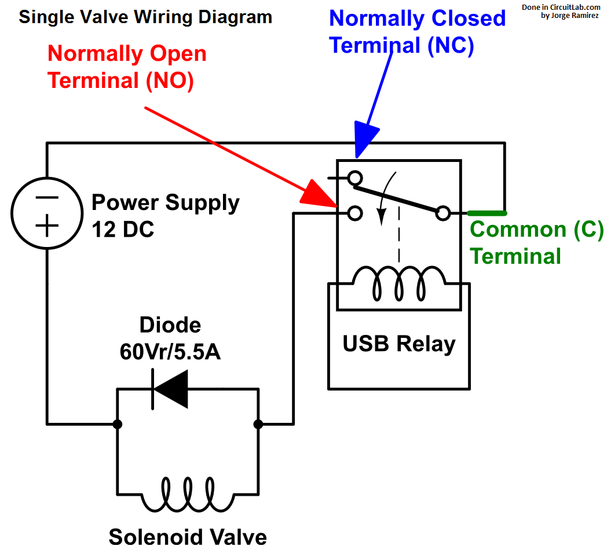
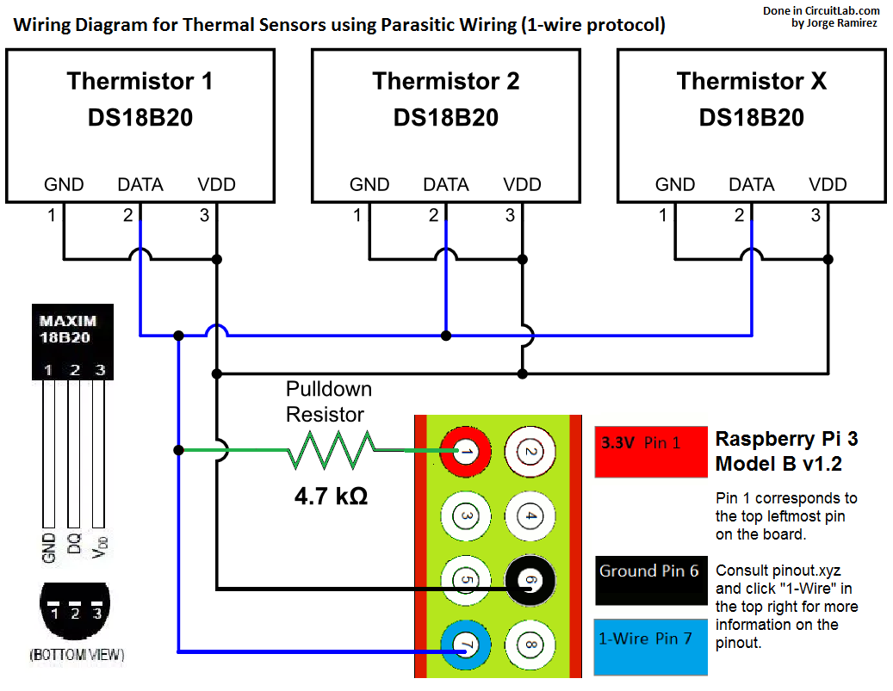

The hardware system has four major components:

1. MARATON power supply: Connected to the crate containing the LVRs and
    is used to provide power to the separate LVR channels.

2. LVRs: Connected to the crate containing the switching load boards and
    have their output connected to the switching load boards.

3. Switching load boards
4. A single Raspberry Pi

The latter two are the parts of the hardware configuration that require the
most setup so they will each receive their own section.

A picture of the final hardware configuration is shown below.

## Switching Load Board Setup
The switching load boards are used to increase the current output by the
LVRs. A picture of the board is shown below:

From the picture there are two separate connections which will have pinouts
to other hardware:

1. The two pinouts on the upper left-side of the board (`P101`) are labeled as
    `V Opto Sec. 5V`. These pinouts are connected to a function generator which
    provides a 5V DC connection to the switching load board. The positive and
    negative terminals connect to the respective positive and negative terminals of
    the function generator.

2. The second connection are the two pinouts on the upper right-side of the
    board (`P102`) which are labeled as `RPi GPIO Control`. The positive
    terminal of this connection connects to one of the many GPIO pins on the
    raspberry pi and the negative terminal connects to one the raspberry pi
    pins labeled `GND`. Any GPIO pins that occur on the pi at pins 11 or lower
    can not be connected to the switching load boards as these GPIO pins are
    reserved for other hardware. This will be further explained in the section
    describing the raspberry pi hardware setup.

Additionally, a python script was made which will pull the GPIO pin
connected to the switching load board high for 60 seconds, then pull
the pin low for 10 seconds and repeat this process until the user
interrupts this process (from `Ctrl+C`). Pulling the GPIO pin high will
power the switching load board and tell it to increase the current
output by the LVRs. The python script will be described more with the
other software below.

## Raspberry Pi Setup
The single raspberry pi for the hardware is considered the brain of the
system as this pi controls all of the software for the system and controls
the power to the hardware.

The raspberry pi for this system is version 3B+ and has a MicroSD card
configured to run the `NixOS` operating system (Linux-based). The pi must
be connected to a monitor and keyboard in order to control the system.

!!! note
    The grounding for the pi is through the shield of the HDMI cord
    connecting the monitor to the pi. This means that the monitor conencted to
    the pi **must** have a three-prong power cord to ensure that all GNDs in
    the system are referencing the Earth GND.

The raspberry pi controls most of the smaller hardware parts of the system
including the USB relay (used to control the CP100 Rain Bird Solenoid Valve),
the water alarm, the fire alarm and all of the thermistors.

!!! note
    The power for the thermistors and the fire alarm both come from
    the `3.3V` pin of the pi although there is only one `3.3V` pin. To fix
    this we made a wire which starts at the `3.3V` pin of the pi and forks
    out to make two connections.

!!! warning
    There are actually two `3.3V` pins on the raspberry pi, however
    the second `3.3V` pin is not near the other power pins. Due to this, we
    decided to continue use of the forked connection as it is best to keep all
    power connections in one place.

A picture of all connections to the raspberry pi GPIO pins is shown below.

### USB Relay and Solenoid Valve
The USB relay and solenoid valve control the water flowing to the LVR crate.
This water is used for cooling the crate if it gets too hot. A diagram of
the circuit is shown below.

The USB relay in this diagram would be connected to the raspberry pi via USB.
Multiple solenoid valves can be inserted into this system although now we
only have one solenoid valve in use as each solenoid valve in the system
requires its own diode and normally open (NO) terminal.

### Water Alarm
The water alarm is used to measure if water is leaking on the floor next to
the crate containing the LVRs. This would occur if the tubes connected to
the solenoid valve started to leak. If water is detected then the software
will output a `WATER` message. The water alarm is a
[floor water sensor by Level Sense](https://www.amazon.com/Floor-Water-Sensor-Flood-Detection/dp/B079YB1T8J/ref=cm_cr_srp_d_product_top?ie=UTF8 "Water Sensor on Amazon").

The water alarm has a red wire, which is connected to one of the `5V`
connections on the pi, and a white wire, which is connected to pin 11 of
the pi (`GPIO17`) with a pull-down resistor of 4.7K.

### Fire Alarm
The fire alarm is used to detect if smoke is rising from the crate
containing the LVRs. If smoke is detected then the alarm will trigger
and the software will output a `FIRE` message.

The fire alarm has three connections to the pi. The grey wire from the
alarm will connect to one of the `GND` pins of the pi. The blue wire
from the alarm has two connections with a pull-down resistor
connecting them. The red only wire soldered to the blue wire is the
power for the alarm and is connected to one of the forked `3.3V`
connections. The red wire with black markings soldered to the blue
wire is the control for the alarm and is connected to pin 8
(`GPIO14`) of the pi.

### Thermistors
The thermistors are used to measure the temperature of the LVRs being
burned-in. The thermistors have their values averaged to obtain the
nominal temperature of the crate.

If the crate has a temperature of 30C or higher then the solenoid
valve is turned to allow water to flow to the crate and aid in cooling
the crate. Once the crate has a temperature of 29C or lower then the
solenoid valve is turned off and water flow stops to ensure that
the crate does not continue to cool.

The thermistors all have their GND legs soldered to their VDD legs
and are connected in parallel to each other via a breakout board
connected to the pi. The breakout board has one rail for the GND
connection of each thermistor and one rail for the data obtained
by the thermistor. A diagram of the circuit is shown below.

The connections to the pins of the pi in the diagram are the same
as the connections to the pins of the pi in use for the burn-in.

!!! warning
    It has been observed that the w1 devices (`/sys/bus/w1/devices/`)
    lost connections with the pi for unknown reasons.

    If you see the error from `CtrlClient.py`:
        An error occurred when trying to read sensor: /sys/bus/w1/devices/28-0000098d8197/w1_slave

    or no temperature reading in logs/DataServer.log, try replugging the 3 GPIO
    connectors and the thermal sensor breakout board connectors.
