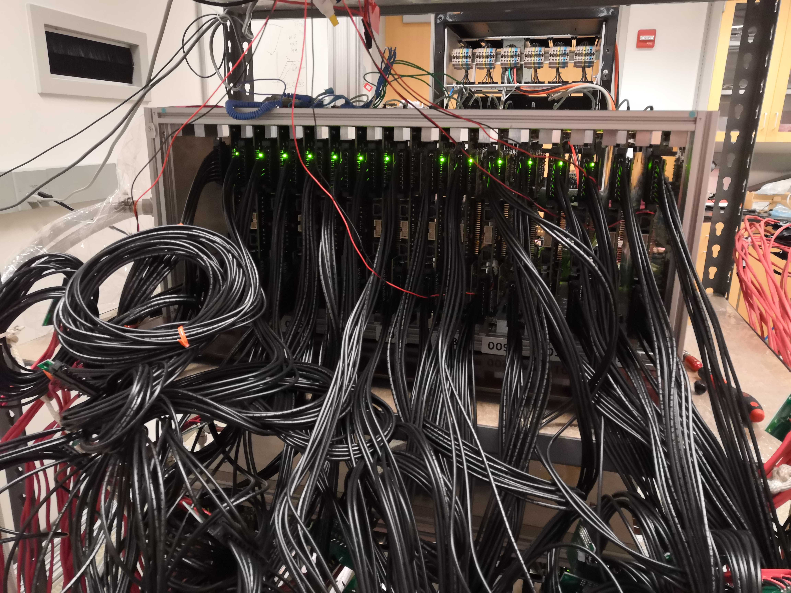
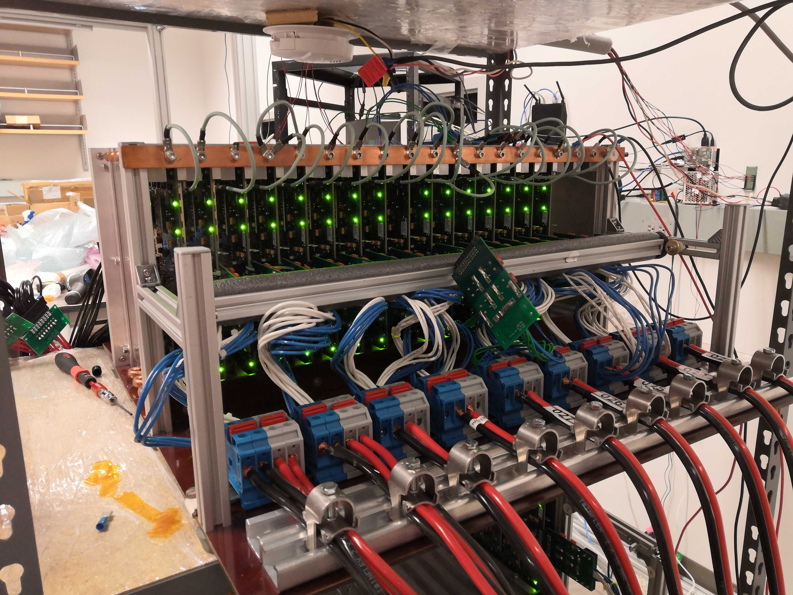

## Overview

Currently, LVR burn-in maximum capacity is 16 boards:

- 2 x `2V5` (using Switching Load Boards labeled 2V5)
- 14 x `1V2`/`1V5` (using the rest of Switching Load Boards)

Each batch should be burned-in for 48 hrs, with switching loads and thermal cycles. The current profile is:

- switching between high (normal) current for 50s and low current for 10s
    
    !!! info
        So that voltage regulator chips are frequently exercised by changing
          states, while in typical operation (high current) most of the time

- bang-bang controlling board temperature between ~30C and ~50C

    !!! info
        For reference, constant-cooling equilibrium is ~30C and overtemperature lockout is 70C.

## Start burning in a new batch

1. Inspect the "ready for burn-in" box and decide on the LVR types
2. Update the database according to the selected LVRs' IDs
3. Mount LVR in the SBC, and double-check that wedge locks are tightened
4. Check the status of Maraton 

    !!! warning
        If it's already running for DCB burn-in, be careful not to touch exposed live wires in the lower SBC

5. Attach thermal sensors on 4 boards:
    1. put sensor's flat side against an open area of the board (without SMD componments)
    2. press the sticky putty to secure sensors in place
    3. you'll have more room to work with before installing adjacent boards

6. Connect the output cables to LVR, and double-check which switching load board the cables connect to

    !!! info
        The output breakout boards are labeled for 2V5

7. Now install the input breakout boards and grounding cables:
    1. move the horizontal bar back to make space for installation
    2. because there are 2 input breakout boards per Maraton channel, connect
        them in order and not mix between channels
    3. input breakout boards are hard to secure, so sometimes zip ties are needed
    4. after all boards are connected (some horizontal tilt unavoidable), push and secure the bar
    5. double-check the connectors, especially for vertical tilt (resulting in partial connection)
    6. verify grounding cable connection

8. Double-check that the chiller is on
9. Turn on the Maraton

10. Start running the python scripts as described in [here](../burnin_sw_setup.md#scripts-to-run-on-the-raspberry-pi)
    1. Note that you need to use `Ctrl` + `b` then arrow to switch `tmux` panel
    2. You can use `Ctrl` + `r` to reverse search past command lines

11. Turning on one Maraton channel (channel numbers are labeled on SBC) as described in [here](../burnin_sw_setup.md#controlling-the-psu-maraton-with-curl)
    1. after issuing command, verify all LEDs are on: 1 in the front **and 4 in the back**. If not, turn off the channel and check connections (e.g. only 4 LVR channels on due to partial input connection)
    2. use multimeter to spot check voltages across the output breakout boards -- should be the set voltage plus some drop (e.g. 1V5+0.2V)

12. Repeat for other channels
13. At this point, all LVRs are running with low currents, before load-switching (seeing 5 Ohm fixed load)
14. Make sure that the Switching Load Boards' secondary voltage supply is on
    (5V, 0A), and the cooling fans are on

15. In another panel, start running the `SwLoadTest.py` (`src/demo/SwLoadTest.py`)

    !!! note
        Verify the changing current (2A/0A) on the voltage supply

16. Now Switching Load Boards are in working state, LVRs are changing between
    high/low-current states and heating up quickly
17. Go to [monitoring website](http://129.2.92.92:56789/DVApp) and verify the temperature
    measurements (should be going up from ~30C)

18. Monitor and wait for the upper temperature target (40C), and verify the USB
    relay switched on (click and red LED)

    !!! info
        Now valve is open for cooling water

19. Use FlIR camera to check for abnormally hot (>60C) spots, both on the LVRs and the SLBs
20. Give yourself a pat on the back -- burn-in has started

## Stop the burn-in

1. Before turning off the Maraton channels, check that:
    1. all 4 LEDs on the back are on (indicating all 8 LVR channels have been on).
    2. no hot spot >60C on FLIR
    3. Check voltages on output breakout boards, e.g. 1V5 + ~0.2V drop

2. Turn off Maraton channels one by one.

    !!! note
        Verify that the LEDs are off

3. Stop the control and monitoring scripts (`CtrlServer.py`, `CtrlClient.py`, `SwLoadTest.py`) by `Ctrl` + `C`

    !!! note
        You need to use `Ctrl` + `b` then arrow to switch tmux panel
        
        Some transmission failure messages may have covered the panel running `CtrlClient.py`

        For future convenience: after scripts are stopped, `Ctrl` + `L` to
        clear, then up arrow to bring up the last command
    
    !!! warning
        The USB relay may still be closed (red LED on) after scripts are stopped, if the last measured temperature is higher than the lower target (31C). 
        Then the DC power supply will keep pushing the solenoid valve on (not ideal).
        Therefore, after the next step, when thermal sensors are detached and cooled down to < 31C, run `CtrlServer.py` and `CtrlClient.py`. 
        The measured T would trigger the condition to switch the relay open (red LED off). Then stop the scripts. 

4. Disconnect the output cables, and detach the thermal sensors

    !!! warning
        Take care not to pull wires off the sensors' leads

5. Disconnect the input breakout boards (after moving the SBC bar)

    !!! note
        Check for loose connections to the terminal blocks

6. Disconnect the grounding wires
7. Loosen the wedge locks and take out LVRs
8. Double-check the LVR IDs, and update the database

## Monitoring from off-campus

To visit the [monitoring website](http://129.2.92.92:56789/DVApp) from off-campus, you can set up VPN this way:

- Install the VPN client software from [UMD terpware](https://terpware.umd.edu/Windows/title/1840). (You want to select your OS and find it under Network.) 

- Login with your UMD account to connect to vpn.umd.edu (and select Group UMD)
