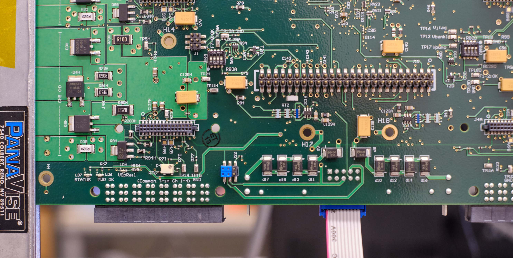

## DCB CERN QA

!!! note
    All these procedures are automated by a single WinCC OA panel, please
    refer to [this section](#use-the-dcb-qa-panel) below on how to use it.

The DCB CERN QA will test the following aspects of 2 DCBs for a single run:

1. Run regular GBTx PRBS test for 2 min.
2. If there's any PRBS error in the previous step, re-run PRBS with 6 mA[^1]
   bias current for 2 min.
3. Run SALT PRBS on available elinks[^2] for 2 min.
4. Read master GBTx status via optical link to make sure master is configurable
   this way.
5. Read all ADC lines that will be used in the final system.

[^1]: Default bias current is 5 mA.
[^2]: Some of the hybrids in the slice test Stave are not working, so we can't
      fully test every elink on DCBs.

### Remove DCBs from PEPI crate

!!! warning "Before you proceed"
    To appease the accelerator god(s), wear anti-static straps at all times and
    install caps on fibers immediately after removal.

    {: align=left }

    

!!! info "Open the MARATON control panel"
    1. Make sure to have a LHCb online account
    2. `ssh -Y <lb_username>@lbgw`
    3. `ssh -Y <lb_username>@utsurface01`
    4. `WCCOAui -proj UTSURFACEHVLV -m gedi &`
    5. Open **JCOP Framework** -> **Device editor and navigator** -> **FSM** tab
    6. Navigate through the tree: **UTSURFACEHVLV** -> **UTSURFAC_LV_MTV** -> **UTLABMTN3**, then right-click and select "view"

!!! warning "Before turning on the LV"
    Make sure to turn on the chiller on the top floor before switching
    the LV.

!!! note
    We are only using the one DCB slot on the **bottom** Pathfinder, slot 4 (the 5th from the left).

1. Turn off bottom power[^3] with the power panel on the MiniDAQ by clicking
   **Bottom OFF** (don't worry about the warning on the panel that this button is "only for
   testing").
2. Turn off the 3V pull-up PSU:
    
3. Pull out DCBs one-by-one, then remove all fibers and FFC[^4].
    

[^3]: "Bottom power" refers to power to 2 bottom DCBs and Hybrids that the 2
      DCBs connect
[^4]: Flexible Flat Cable. Note that FFC cable would be a tautology.

### Install DCBs to PEPI crate

1. Install FFC to the DCB.

    !!! note
        - The 2 FFCs are interchangeable.
        - The FFC should be inserted to the second to right of the opt. mezz,
          when the copper pipes are pointing down (see the picture for FFC
          removal above).
        - Try to do this step carefully, making an effort to ensure the FFC is
          straight and making good contact. This will potentially save time,
          since a bad FFC connection is often what causes a QA failure.

2. Install optical fibers to the DCB.

    !!! note
        The left DCB slot is `JD0`, the right `JD4`. The topmost fiber (in the FFC
        removal picture above) is `1`.

        Therefore, `B0.4` means the 4th fiber from top in slot `JD0`.

3. Install DCB to the correct slot (the one with `B0.x` fibers **must** go to
   `JD0`, `B4.x` `JD4`).

4. Double check the pull-up harnesses are still connected on the FFC breakout
   board. If not, reconnect them according to the picture below (red on third
   from top, black on fourth from top).

    

    Also make sure the other ends are still connected to the 3V pull-up PSU.

5. Turn on the 3V pull-up PSU.
6. Turn on bottom power with the power panel by clicking **Bottom ON**.

### Use the DCB QA panel

!!! info
    The panel looks like this:

    

    The `UTSURFACETEST` project lives in `utsurface02`. To connect, ssh into lbgw then

        ssh -Y <username>>@utsurface02

!!! info
    The log viewer can be launched from command line with:

        WCCOAtoolLogViewer -proj UTSURFACETEST &

    The main user inteface, `gedi` can be opened with:

        WCCOAui -proj UTSURFACETEST -m gedi &

    Next, open **JCOP Framework** -> **Device editor and navigator** -> **FSM** tab, then naviate through the tree: * **UTSURFACETEST** -> **UTSTAVETEST**, right-click and select "view".

1. Once connected to `utsurface02`, launch the DCB CERN QA panel:

        WCCOAui -proj UTSURFACETEST -p objects/fwDCB/UT_DCB_CERN_QA_v2.pnl &

    !!! warning "Establish a working baseline"

        Now it's a good time trying to read the status of master GBTx, to establish
        a working baseline.

        This can be done by clicking the **Read master GBTx status** on the **Debug**
        buttons.

        If you see one or two of the master status can't be read, like this:

        

        then turn off powers and try **reseating** the FFC! It is very likely that the FFC
        is not making good contact!

        If after reseating and swapping FFCs, the master status still can't be read,
        put the board aside, mark it as bad, and install a new board.

2. Input the serial numbers for the 2 DCBs in the **SN** fields
3. Click **Start test**

    !!! info "In case the _Optimize hybrid elinks_ fails"

        The hybrid elinks optimization are more error-prone than the rest of the steps.

        One possibility is that the TFC NZS signal is not sent. To check that:
        **TOP** -> **SODIN** -> **Core 0** -> **Calibration A** and make sure that
        **make NZS** option is ticked.

        **Update 09-17-21: Mark tried to fix this common failure by editing the
        panel; if it still fails, try power cycling, and then perhaps try
        restarting the GbtServ** (run `pkill -9 GbtServ`; note: don't run
        `GbtServ &`, as was done at UMD, since here the necessary processes
        are started automatically) **and possibly try restarting the project**
        (I believe you can just close out the ssh sessions and restart, but Mark
        may know a better way...).

4. Wait for it the test to finish.
5. Take a look at the **Test results** section.

    1. If there's no red fields, then both of the DCBs are OK.
    2. If there's red, document the corresponding DCB as bad.
    3. All test results are also saved in a log file.

Once finished QAing, you can power everything off. Be sure that you don't leave
the optical fibers disconnected and without their plastic caps attached, though,
since we have found them to get dirty quite easily (which will affect their
performance).

## LVR CERN QA

### TCM QA

1. Take a new TCM and set switches 1 and 3 ON
2. Take note of the TCM serial number and insert it into the testing apparatus
   (see image), ensuring to be careful to not break or bend any pins when closing it

     

3. Connect the TCM to the TCB via a Mini IO ethernet cable
4. Turn on the power supply
5. Get to the TCM QA panel (while connected to `lbminidaq2-17` as [for the
   DCB QA](#use-the-dcb-qa-panel)): run

        WCCOAui -proj UTLVTEST -m gedi &

    then locate and open the TCM QA panel (in the `panels` folder).

6. Enter the TCM serial number and then run the TCM QA by clicking ***Start Test***

    !!! warning "QA failure"

        The QA may fail for a number of reasons. As a general note, on any given
        panel, it is often a good idea to hit the ***Start Monitoring*** button,
        if it exists, especially if you have just altered/restarted something.
        Other potential fixes include:

        1. Check that you can detect the SCA where the Mini IO cable is connected
           (should be SCA 0) by opening up the TCB panel (there should be a
           button on the TCM QA panel to open this). If you cannot detect the SCA,
           you can try plugging into another slot on the TCB or try power cycling.
        2. If the TCM QA fails with a message that it failed at the
           "Configuring SCA" step, you can try power cycling, playing with the
           switches on the TCM (in case they weren't properly set), and
           restarting the GbtServ (`pkill -9 GbtServ`). If none
           of this works, set the TCM aside with a note.
        3. If the TCM QA fails with a message that it failed because "ADCs not
           connected" (or similar), set the TCM aside with a note
           including the feedback from the QA panel.

### Proposed LVR nominal voltages

As discussed with Phoebe (but to be altered to account for sense current monitoring
issue found while testing), the proposed voltage ranges for the LVR are

| LVR type | M `VrsR` | M `VregR` |S `VrsR` | S `VregR` |
|---|---|---|---|---|
| `12A`   | $1.25 \pm 0.03$ | $1.4  \pm 0.05$ | -             | -              |
| `12MSA` | $1.25 \pm 0.03$ | $1.4  \pm 0.05$ | $3.7 \pm 0.5$ | $1.4 \pm 0.05$ |
| `12MS`  | $1.25 \pm 0.03$ | $1.4  \pm 0.05$ | $3.7 \pm 0.5$ | $1.4 \pm 0.05$ |
| `15MS`  | $1.52 \pm 0.03$ | $1.7  \pm 0.05$ | $3.7 \pm 0.5$ | $1.7 \pm 0.05$ |
| `25A`   | $2.53 \pm 0.03$ | $2.84 \pm 0.05$ | -             | -              |

!!! info "Nomenclature"
    - `VrsR`: Sense voltage (converted)
    - `VregR`: Output voltage (converted)
    - `VisR`: Sense current (read as a voltage, before conversion)

!!! note
    - All voltages are in unit "V".
    - These expected values are pre-set in the test panel as default valules,
        but they remain user-changeable.
    - Since LVR CERN QA doesn't involve a load, all `VisR` is assumed to be at
        $0.1$.
    - In `12MSA` case, all expected voltages for `A` channels is assumed to be
          the same as that of the `M` channels.
    - For slave `S` channels, the actual sense lines are unconnected.
        Instead, `Master_Vref_Sense_in` is connected.

        (See [LVR schematic](https://raw.githubusercontent.com/umd-lhcb/electronic-projects/master/lvr/schematic_lvr.pdf), p. 4)

    - For `S` sense lines, as long as it's not `rail` (5.5 V) or `GND`, we are
        fine with it.

!!! info
    - The _Output voltage_ `VregR` is the voltaged measured at LVR output
        connector.
    - When sense line is unconnected,
      $\frac{\text{Sense voltage}}{\text{Output voltage}} = \frac{2000 - 249}{2000} = 0.88$.

The LVR QA panel (use described [here](#use-the-lvr-qa-panel)) will automatically
adjust to test the voltages are within these ranges after the LVR type is set in
the panel.

### Update LVR firmware

1. Configure the LVR blue jumpers as shown in here:

    

    !!! note
        These jumpers need to go back to their original positions after the
        firmware update. This is need to ensure some FPGA fail-safe is enabled.

2. Connect the LVR input BB and JTAG to LVR according to this picture, and turn
   on the power:

    

    !!! warning
        The GND shold not be connected during the firmware update process.

3. Use the nearby laptop to update the firmware. The flasher should have been
   opened already and all we need to do is click **PROGRAM**.

    

4. Once the firmware is updated, turn off the power and remove the input BB and
   the JTAG. Don't forget to put the blue jumpers back to their original position

### Install TCM

1. Install the 10 mm standoff, with one washer at bottom and one at top (ie. two
   washers per standoff):

    

2. Align and install the TCM, with the Mini IO cable connected to it (and the TCB)

### Use the LVR QA panel

1. Connect all the CCMs on the LVR according to the board subtype
2. Connect the GND to LVR. See the TCM standoff picture for GND connection.
3. Re-connect the input BB, and turn on the power
4. Launch the LVR CERN QA panel in a terminal:

        WCCOAui -proj UTLVTEST -p fwTelemetry/QA_LVR.pnl &

    !!! info
        The panel looks like this:

        

5. Input LVR and TCM serial number.
6. Choose the correct LVR type and subtype.
7. Click **RUN TESTS**
8. Assuming the board passes, turn the power off and disconnect everything,
   keeping the TCM and CCMs installed on the LVR

    !!! info "QA Failure because of high `Vis`"

        We have found that a handful boards seemingly "fail" because of an
        unanticipated issue caused by the TCM reference voltage being tied to
        GND. During the testing at UMD, the ref was tied to 1.5V, so the issue
        was not observed. Also, I believe the expectation is that when the LVR
        is connected to a load, regardless of whether the TCM is tied to GND,
        the high `Vis` "issue" should go away (check this with Phoebe...).

        If you find a board that fails the QA because of one (or more) channels
        (say, channel `j`) reading out a high `Vis`, as long as you can verify
        the anomalous readings go away when the TCM reference is tied to 1.5V,
        you can pass the LVR. To do this, follow these steps:

        1. With the LVR on and the TCM attached, just verify with a multimeter
           that the reading from the LVR QA panel is correct. To do this, first
           get an "unconverted" reading from the QA panel by unchecking the
           "converted data" checkbox, and note the "`Vis`" value for the
           problematic channel (this is now in V). Then, referencing the TCM
           schematic below, probe (on the solder pads on the TCM) between
           `i_SENSE_MONj` and `GND` (say, pin 2). This voltage readout should
           match what is reported in the QA panel. Note that we "expect" (based
           on experience) this voltage to be <60mV. If it's larger, check with
           Phoebe before proceeding.
        2. Next, turn the LVR off and remove the TCM. As in the initial QA at
           UMD, turn on dip switch 1 on SW5 (on the back of LVR). Turn the LVR
           back on. You will now connect, using a wire between LVR pin pairs
           that connect to the TCM, pin 12 (`i_SENSE_MON_REF`) to another
           pin and then again probe between `i_SENSE_MONj` and `GND`. First, as
           another sanity check, connect pin 12 to `GND` (say, pin 11); probing
           between `i_SENSE_MONj` and `GND` should return the same voltage
           reading as above. Second, connect pin 12 to 1.5V (say, pin 35). You
           should now see (to within a few mV) 1.5V when probing between
           `i_SENSE_MONj` and `GND`.
        3. If this all works correctly, you can pass the LVR, but put a note
           in the UMD database. Also, turn off dip switch 1 on SW5 and reinstall
           the TCM before putting away the LVR.

           

    !!! warning
        There's a latch that needs to be released manually when trying to
        unplug the Mini IO cable.

        

9. In the case of an LVR with MS channels, test that the soldering was done
   correctly using a multimeter. Note that the sets of 6 pins in the
   image below should all be at the same voltage. With the multimeter, probe
   the resistance between the indicated blue, red, and green lines. The blue
   tests that the soldering was successful (expect a reading near 0 Ohm), the
   red tests that the soldering didn't damage anything (expect a reading near
   80 Ohm), and the green tests that the LVR power and chassis GND are
   still isolated (expect a reading >=25 kOhm).

   

### Installing LVR to SBC

1. Check that CCMs and TCM are properly installed and sit flat
2. Make sure the wedgelocks are loose, and slide the LVR into the SBC

3. Make sure the wedgelock is locked with specified torque of 80 cNm (7 inch-ft).

    !!! info
        - The name of the LVR wedgelock is [Birtcher wedgelock retainer (40-5-12-T)](https://schroff.nvent.com/en-gb/products/enc40-5-10-b-lf-ln-m?selectionPath=0%7C0%7C0%7C0%7C0%7C0%7C0%7C)
        - The data sheet of the wedgelock can be found [here](https://schroff.nvent.com/sites/g/files/hdkjer281/files/acquiadam/2020-11/40-5_DataSheet.pdf)

4. Test the isolation of `GND` and `GND_earth` after connecting the `GND_earth`
    cables from SBC to LVR.

    !!! info

        This can be done with a multimeter. Fix one probe on SBC, while use the
        other end to probe on the right-most pin of the right LVR output
        connector (see picture below).

        

        **One LVR only needs to be probed once.**

    !!! info
        The `LV_RETURN` is connected to `GND` on LVR, but not the `GND_earth`.
