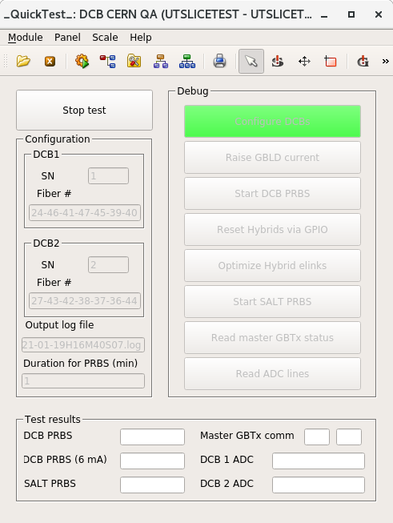

## DCB CERN QA

!!! note
    All these procedures will be automated by a single WinCC OA panel, please
    refer to [this section](#use-the-dcb-qa-panel) below on how to use it.

The DCB CERN QA will test the following aspects of 2 DCBs for a single run:

1. Run regular GBTx PRBS test for 2 min.
2. If there's any PRBS error in the previous step, re-run PRBS with 6 mA[^1]
   bias current for 2 min.
3. Run SALT PRBS on available elinks[^2] for 2 min.
4. Read master GBTx status via optical link to make sure master is configurable
   this way.
5. Read all ADC lines that will be used in the final system.

[^1]: Default bias current is 5 mA.
[^2]: Some of the hybrids in the slice test Stave are not working, so we can't
      fully test every elink on DCBs.

### Remove DCBs from PEPI crate

!!! warning "Before you proceed"
    To appease the accelerator god(s), wear anti-static straps at all times and
    install caps on fibers immediately after removal.

    {: align=left }

    

!!! note
    We are only using the 2 DCB slots on the **bottom** Pathfinder.

1. Turn off bottom power[^3] with the power panel on the MiniDAQ by clicking
   **Bottom OFF**.
2. Turn off the 3V pull-up PSU:
    
3. Pull out DCBs one-by-one, then remove all fibers and FFC[^4].
    

[^3]: "Bottom power" refers to power to 2 bottom DCBs and Hybrids that the 2
      DCBs connect
[^4]: Flexible Flat Cable. Note that FFC cable would be a tautology.

### Install DCBs to PEPI crate

1. Install FFC to the DCB.

    !!! note
        - The 2 FFCs are interchangeable.
        - The FFC should be inserted to the second to right of the opt. mezz,
          when the copper pipes are pointing down (see the picture for FFC
          removal above).

2. Install optical fibers to the DCB.

    !!! note
        The left DCB slot is `JD0`, the right `JD4`. The topmost fiber has the
        index `1`.

        Therefore, `B0.4` means the 4th fiber from top to bottom at slot `JD0`.

3. Install DCB to the correct slot (the one with `B0.x` fibers **must** go to
   `JD0`, `B4.x` `JD4`).

4. Double check the pull-up harnesses are still connected on the FFC breakout
   board. If not, reconnect them according to the picture below.

    

    Also make sure the other ends are still connected to the 3V pull-up PSU.

5. Turn on the 3V pull-up PSU.
6. Turn on bottom power with the power panel by clicking **Bottom ON**.

### Use the DCB QA panel

!!! info
    The panel looks like this:

    

1. Launch the DCB CERN QA panel in a terminal:

        WCCOAui -proj UTSLICETEST -p objects/fwDCB/UT_DCB_CERN_QA.pnl &

    !!! warning "Establish a working baseline"

        Now it's a good time trying to read the status of master GBTx, to establish
        a working baseline.

        This can be done by clicking the **Read master GBTx status** on the **Debug**
        buttons.

        If you see one or two of the master status can't be read, like this:

        

        Turning off powers and try **reseating** the FFC! It is very likely that the FFC
        is not making good contact!

        If after reseating and swapping FFCs, the master status still can't be read,
        put the board aside, mark it as bad, and install a new board.

2. Input the serial numbers for the 2 DCBs in the **SN** fields
3. Click **Start test**
4. Wait for it to finish.
5. Take a look at the **Test results** section.

    1. If there's no red fields, then both of the DCBs are OK.
    2. If there's red, document the corresponding DCB as bad
    3. All test results are also saved in a log file.

## LVR CERN QA

!!! note
    All these procedures will be automated by a single WinCC OA panel, which is
    still in th work.

1. Launch the LVR CERN QA panel in a terminal:

        WCCOAui -proj UTSLICETEST -p fwTelemetry/LVR_v4.pnl &
