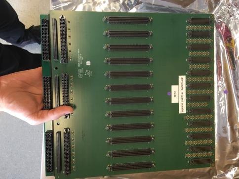
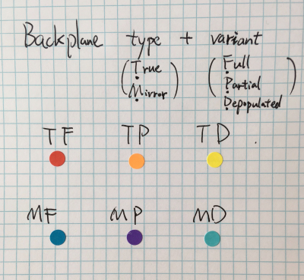
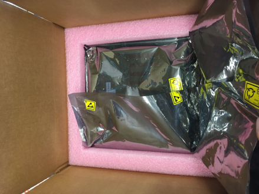
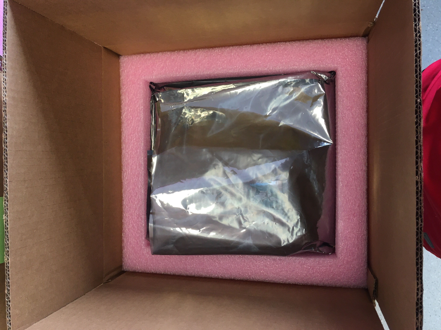

## DCB
Carefully examine the backplane and mezzanine connectors (both for the DCB and
mezzanines), looking for any bent or broken pins or any other signs of excessive force

The heat pipes are not perfectly straight, but check that they are not too bent for the cooling setup

Do a brief visual scan of the visible side of the board for cracked components or torn pads

## LVR
Check the TCM and CCM connectors for bent or broken pins or any other
signs of excessive force

Check that no potentiometers or switches are missing from the board

Do a brief visual scan of the visible side of the board for cracked
components or torn pads

## Backplane
You can open the beautifully formatted Google Doc for [backplane visual inspection and preparation checklist](https://docs.google.com/document/d/1PeLf8cPsfiIbphA_Zs2zO9EygfJ2MGr45PjirhIQkUE/edit#heading=h.vb8p0lepu9vn)

Or see its content below:

Shipment package
Visual inspection of the outer box and inner boxes
Shock-watch sticker on the outer box 
Taking out the backplane
Open from the top side of the inner box
Practice ESD safety (e.g. wrist strap) when moving backplanes
Always hold most of the backplane's weight from the rugged JPU/JPL side. Be very careful not to apply unnecessary pressure on/near pigtail (JP) connectors. See picture below:

Use pressurized air to dedust (especially pigtail/DCB connectors)
Use Deoxit lubricant with brush, for cleaning and lubrication: for each connector, dip the brush in bottle, stroke brush along bottle inner edge to remove excess, then carefully brush over each row of pins (not just pin tip)
Check the pigtail and DCB connectors (JP 0-11, JD 0-11)
Guideposts should not be bent or offset
Pins should be well aligned within each connector
Check the P2B2 pins + sockets (near JP 0-11 and JPL 0-2)
Pins should not be bent
Sockets should not detach from board pads, or offset above board surface
Check the engagement of P2B2 to Backplane (sideview)
Plastic spacers (top/middle/bottom) should be in place, and pressing against both boards
Store the cleaned backplanes inside its ESD bag
Each backplane has a color label to indicate type/variant, for easy identification during installation
Check for type/variant consistency on backplane, ESD bag, and box:

To protect the ready-for-install backplanes when moving them around, fold the ESD bag and carefully press it into the bottom foam:

Because the top foam with the legs would have put much pressure through the bag onto pigtail connectors, remove the legs and then put it into the box. Alternatively, put in some ESD bubble wrap and leave the top foam out. 
Always keep the backplane and the box top side up. 

