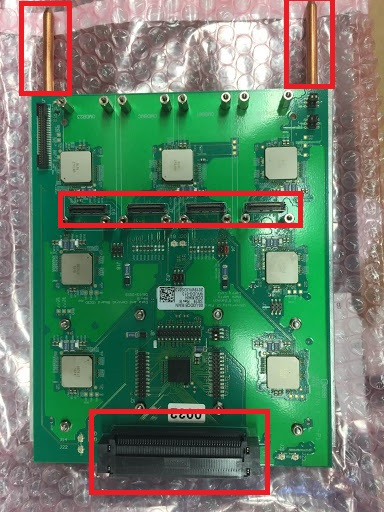
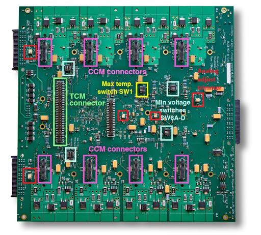

## DCB
Carefully examine the backplane and mezzanine connectors (both for the DCB and
mezzanines), looking for any bent or broken pins or any other signs of excessive force

The heat pipes are not perfectly straight, but check that they are not too bent for the cooling setup

Do a brief visual scan of the visible side of the board for cracked components or torn pads

## LVR
Check the TCM and CCM connectors for bent or broken pins or any other
signs of excessive force

Check that no potentiometers or switches are missing from the board

Do a brief visual scan of the visible side of the board for cracked
components or torn pads

## Backplane
You can click the link to the Google Doc for [backplane visual inspection and preparation checklist](https://docs.google.com/document/d/1PeLf8cPsfiIbphA_Zs2zO9EygfJ2MGr45PjirhIQkUE/edit#heading=h.vb8p0lepu9vn)
