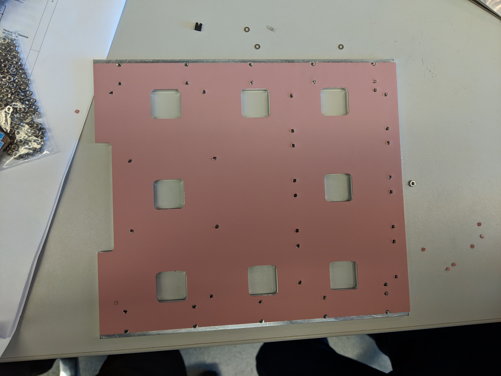
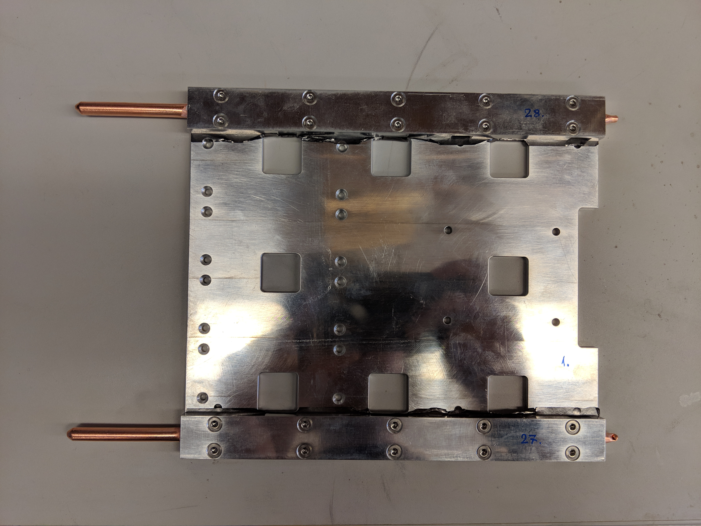
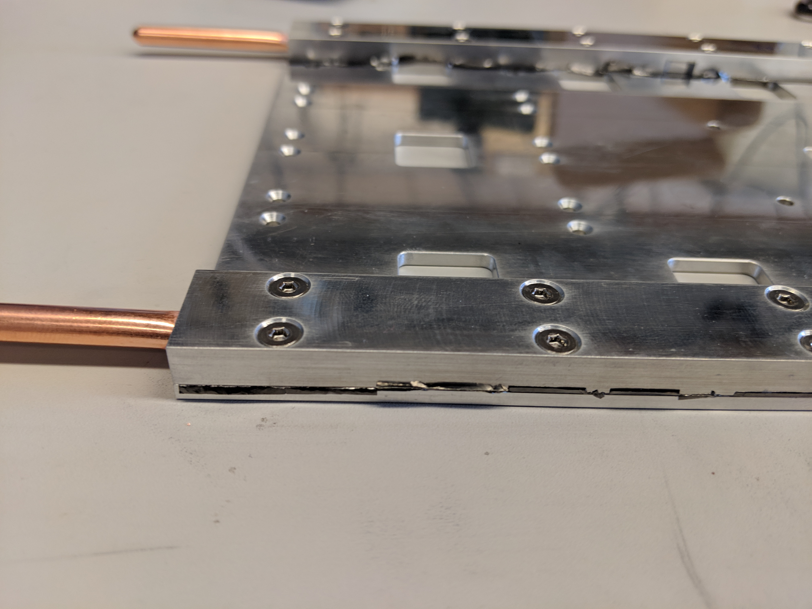

## Visual inspection of new DCB

Record serial number from sticker on the DCB to the 
[database](https://docs.google.com/spreadsheets/d/1KjXGhOFzi0SZPsozpKzxGjVtfr4kkS_Hv5EigUwKOj8/edit){target=_blank}
and put a new label on the board.

!!! warning
	Make sure you are grounded at all times when handling the DCB!

1. Look for scratches, gouges, and any other signs of obvious damage on the 
   surface of the DCB.
   
2. Inspect more thoroughly by focusing on 1 GBTx cluster at a time. All clusters
   should be the same and include the same components. If a piece appears to be 
   missing, compare to the other groups. If they are all the same, it is likely 
   correct
	- Look for any pieces that are bent, broken, or otherwise askew within each
	  cluster.
	   
    !!! note
		Each GBTx has a marked corner which must match a white dot on the DCB. 
		The black SCA also has marked corner and dot.
		
	!!! note
		There are also a couple small components, the ones next to pieces 
		labeled "R500", with faint white lines on one side. That side also 
		points to a white dot on the DCB
		
	- Insert pics of of each component that has to match with a white dot

3. Now look at the 4 mezzanine connectors (the connectors inside the outline).
   Angle the DCB to see each pin clearly and confirm there are no globs of 
   solder possibly connecting two pins. Also confirm that no pins are bent or 
   broken.

4. Finally examine the large backplane connecter on the other end of the DCB.
	- Look into the connector at the pins and make sure they are all uniform.
	  A bent pin could break a backplane.
	- Tilt the DCB to look between the board and the connector. It is attached
	  by many small solder pads so must lay flat and straight. Any angle or
	  disconnected pads should be noted.
   

## Install thermal gap filler on the DCB backplate
There are pre-cut thermal fillers for the DCB backplate. Peel the film off and
put it on, making sure that the pre-cut holes align with the holes of the DCB
backplate. It is much easier to ensure the thermal gap filler is straight if
two people work together.

!!! warning
    Make sure that the thermal gap filler is placed on the **flat** side of the
    backplate.

    The backplate is not symmetrical. The thermal gap should be put on the side
    that **doesn't** have countersuck screw holes.

Once the thermal gap filler looks straight then use a screw to take out any
leftover thermal gap filler over the screw-holes that may have not been trimmed
off. This will ensure that the backplate will connect smoothly to the DCB and
that no residue from the thermal gap filler will attach to the DCB.

## Install the heat pipe on the DCB backplate

To install the heat pipes:

1. Put a thin line of thermal grease on the pipes using a spreader, not going 
   all the way to the edges. The grease squeezes out when the pipes are 
   installed and tightened.

2. Use 10 {==M.3==} countersunk bolts to secure the heat pipe to the
   backplate. Note that it is easiest to screw in opposite diagonal bolts
   first to fix the heat pipe.
   
4. Wipe away excess grease along the sides of the heat pipe. Can use Isopropyl
   Alchohol to clean residue if needed (above 70% IPA).

3. Repeat for the second heat pipe.

!!! warning
    Pay attention to the direction of the heat pipe! The long end should point 
	toward the flat side of the backplate and the short piping toward the 
	notched side.

Follow the pictures below for further guidance or if anything is not clear.

## Final assembly

!!! note
    The final assembly is easiest with two people!

For final assembly of the board:

1. Use 16 {==M.2.5==} countersunk bolts along with 16 long {==M.2.5==}
   hexagonal nuts to install the DCB backplate onto the DCB and provide 
   supports for the optical mezzanines. The bolts should be placed on the 
   backplate side and should fit into the countersunk holes while the nuts will
   sit on top of the DCB. Again fix opposite diagonal bolts first.
   
    !!! note
		This is for the flat edge/long pipe side of the assembly.

    !!! warning
        The nuts on top of the DCB **should not be rotated** as they will
        damage the surface of the DCB. In order to prevent this secure the nut 
		using pliers or a socket wrench and use a screwdriver to tighten.

2. Use 8 {==M.3==} countersunk bolts along with 8 short {==M.3==} hexagonal nuts
   and Kapton washers to secure the notched side of the backplate. The washers 
   should be placed on the DCB to protect it from the hex nut.

    !!! warning
        The nuts on top of the DCB **should not be rotated** as they will
        damage the surface of the DCB. In order to prevent this secure the nut 
		using pliers or a socket wrench and use a screwdriver to tighten.

3. Finally, install the optical mezzanines. (To be added)

    !!! warning
        The standoff/screw on the DCB side **should not be rotated** to avoid
        damages to the surface of the DCB.

Input a picture of the final setup here.

## Continuity check

Measure the resistance between any of the `TP5` around the data GBTxs and the
aluminum backplate. The resistance should be very large to ensure the backplate
is not electronically connected to the DCB.
