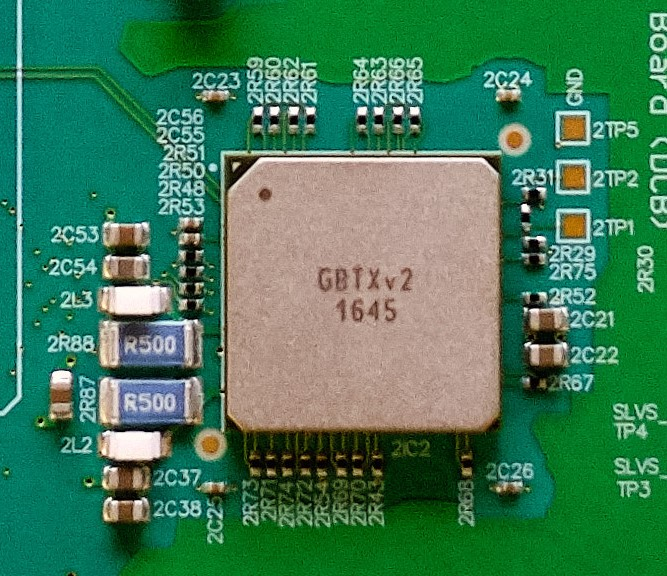

For a summary of tasks, if you're already familiar with the assembly procedure,
see [here](https://github.com/umd-lhcb/ut-hw-doc/tree/master/docs/dcb/dcb_assembly/extra/dcb_assembly_checklist.pdf).

!!! tip
    It is generally much quicker to work
    on multiple boards in parallel. After getting used to the assembly procedure,
    when working in parallel it should generally take around 1 hr/board assembly
    (assuming no slow-downs due to missing parts, etc).
!!! info
    Most of the equipment needed for assembly should be able to be found on the
    downstairs table at any given moment. The new DCBs should be in boxes under
    that table, and new backplates, heat pipes, and thermal fillers should
    be in boxes nearby. The optical mezzanines are placed in a labeled grey
    cabinet, while the VTT/Rxs are in a black cabinet (all downstairs).

## Thermal gap filler installation

There are pre-cut thermal fillers for the DCB backplate. Peel the film off and
put it on, making sure that the pre-cut holes align with the holes of the DCB
backplate. It is much easier to ensure the thermal gap filler is straight if
two people work together, or if working alone, it makes it easier if you only
partially remove the film, position the thermal filler on the backplate, and
then slowly peel off the rest of the film while letting the filler fall flat
into place on the backplate.

!!! warning
    Make sure that the thermal gap filler is placed on the **flat** side of the
    backplate.

    The backplate is not symmetrical. The thermal gap should be put on the side
    that **doesn't** have countersunk screw holes.

Once the thermal gap filler looks straight, use a screw to take out any
leftover thermal gap filler over the screw-holes that may have not been trimmed
off. This will ensure that the backplate will connect smoothly to the DCB and
that no residue from the thermal gap filler will attach to the DCB.

## Heat pipe installation

To install the heat pipes:

1. Put a thin line of thermal grease on the pipes using a spreader, not going
   all the way to the edges. The grease squeezes out when the pipes are
   installed and tightened. You can use the plastic spreader to even out the
   thermal paste.

2. Use 10 {==M.3==} countersunk bolts to secure the heat pipe to the
   backplate. Note that it is easiest to screw in opposite diagonal bolts
   first to fix the heat pipe. **Note the orientation of the heat pipe in the
   image below**

4. Wipe away excess grease along the sides of the heat pipe. Can use Isopropyl
   Alcohol to clean residue if needed (above 70% IPA).

3. Repeat for the second heat pipe.

Place a numbered sticker in the center of the backplate, as shown (note the
first image is a fully assembled DCB; you won't have the board screwed in yet).
Follow the pictures below for further guidance or if anything is not clear.

## Inspection of new DCB

!!! warning
    **Make sure you are grounded at all times when handling the DCB!!**

1. Look for scratches, gouges, and any other signs of obvious damage on the
   surface of the DCB.

2. Inspect more thoroughly by focusing on 1 GBTx cluster at a time. All clusters
   should be the same and include the same components. If a piece appears to be
   missing, compare to the other groups. If they are all the same, it is likely
   correct
    - Look for any pieces that are bent, broken, or otherwise askew within each
      cluster.

    !!! note
        Each GBTx has a marked corner which must match a white dot on the DCB.
        The black SCA also has marked corner and dot.

    !!! note
        There are also a couple small components, the ones next to pieces
        labeled "R500", with faint white lines on one side. That side also
        points to a white dot on the DCB

    The dots are on the top left in this example
    

3. Now look at the 4 mezzanine connectors (the connectors inside the outline).
   Angle the DCB to see each pin clearly and confirm there are no globs of
   solder possibly connecting two pins. Also confirm that no pins are bent or
   broken.

4. Next flip the DCB over so that you are looking at the bottom side of the
   DCB. Check the bottom side near the optical mezzanines to ensure that there
   are no extra globs of solder protruding through the surface of the DCB.

    !!! note
        If there are extra globs of solder present then it can short the DCB
        when assembled to the backplate.

    An example of the extra globs of solder is shown here
    

5. Place Kapton tape on solder pads, as shown in the image below (regardless of
   whether the pads seem to have excess solder). If any other excess solder
   globs are present, similarly place Kapton tape on them.
   

6. Finally examine the large backplane connecter on the other end of the DCB.
    - Look into the connector at the pins and make sure they are all uniform.
      A bent pin could break a backplane.
    - Tilt the DCB to look between the board and the connector. It is attached
      by many small solder pads so must lay flat and straight. Any angle or
      disconnected pads should be noted.

7. Place a small sticker near the backplane connector (again, the image below
   is of a fully assembled DCB; it's just meant to demonstrate the placement
   of the sticker)
   

## Final board assembly

!!! tip
    There are a lot of screws for this step. In addition to the continuity check
    to ensure the board and backplate aren't shorted after screwing everything
    in, it is likely a good idea to check the grounds are isolated after only
    screwing in a few screws. This may save you the time of unscrewing/re-screwing
    *everything* if the board and backplate are shorted.

!!! tip
    After tightly screwing in a few screws and testing ground isolation, in
    general it probably saves time to loosely screw everything in first and then
    tighten later.

1. Use 16 {==M.2.5==} countersunk bolts along with 16 long ("standoff") {==M.2.5==}
   hexagonal nuts and Kapton washers (part# 5611-33-5) to install the DCB
   backplate onto the DCB and provide supports for the optical mezzanines. The
   bolts should be placed on the backplate side and should fit into the
   countersunk holes while the nuts and washers will sit on top of the DCB.
   Again fix opposite diagonal bolts first.

    !!! note
        This is for the flat edge/long pipe side of the assembly.

    !!! warning
        The nuts on top of the DCB **should not be rotated** as they will
        damage the surface of the DCB. In order to prevent this secure the nut
        using pliers or a socket wrench and use a screwdriver to tighten.

2. Use 8 {==M.3==} countersunk bolts along with 8 short {==M.3==} hexagonal nuts
   and Kapton washers (part# 5611-130-5) to secure the notched side of the
   backplate. The washers should be placed on the DCB to protect it from the
   hex nut.

    !!! warning
        The nuts on top of the DCB **should not be rotated** as they will
        damage the surface of the DCB. In order to prevent this secure the nut
        using pliers or a socket wrench and use a screwdriver to tighten.

3. Install jumpers to the board according to the picture, these are needed
   to configure the DCB.

    - They should be oriented with their metal side away from the board

    Red Lines are where the jumpers go
    

    !!! note
        You should install 10 jumpers to the following connectors:

        - **`J2`** pins 1-3, 4-6
        - **`J4`** pins 3-4
        - **`J10`** pins 3-4, 5-6
        - **`J12`** 1-2, 3-4, 5-6
        - **`J13`** 1-3, 2-4

**Note to self: include picture of top of fully assembled DCB, w jumpers, here**

## Continuity check

Measure the resistance between any of the `TP5` around the data GBTxs and the
aluminum backplate. The resistance should be very large to ensure the backplate
is not electronically connected to the DCB.

## Optical Mezzanines

Each DCB needs 4 optical mezzanines, **3 with VTTxs** and **1 with a VTRx**. An
assembled mezzanine will look like this, where the black component in a yellow
casing is a VTTx.

!!! note
    A VTTx is **black** while a VTRx is **red**. They both have a yellow casing
    and look the exact same otherwise.

1. The VTT/Rxs have nubs on top that don't fit into the slot on the mezzanines.
   Take a pair of wire cutters and clip them off to be flush with the rest of
   the plastic casing.
    - this can cause the holes to close over with plastic. Take a metal pick
      and carefully clear out the residual plastic to make a clean hole.
    

2. Plug in a VTT/Rx and make sure the holes are aligned with the slot on the
   mezzanines front

3. Screw in 2 {==M1.4==} bolts to attach the mezzanine and the VTT/Rx, tighten
   gently.
    - It can be really hard to get the tiny bolts to work. If you're having
      trouble, use tweezers to hold the bolt in place while putting a decent
      amount of force into the hole while you start to screw it in

4. Repeat for 4 total mezzanines. Make sure one has a red VTRX while the rest
   have VTTxs

## Update database

You've assembled a DCB! Record the sticker serial number to the
[database](https://docs.google.com/spreadsheets/d/1KjXGhOFzi0SZPsozpKzxGjVtfr4kkS_Hv5EigUwKOj8/edit "Database"). Place assembled board back in ESD bag and bubble wrap, and put in
box with other assembled DCBs (may be upstairs near the initial QA setup). Place
assembled mezzanines back in ESD bags, and put them upstairs in a box near the
initial QA setup. Don’t throw out the bubble wrap for the mezzanines; it’ll be
used for shipping. Put it back on top of the cabinet with all the new optical
mezzanines.
