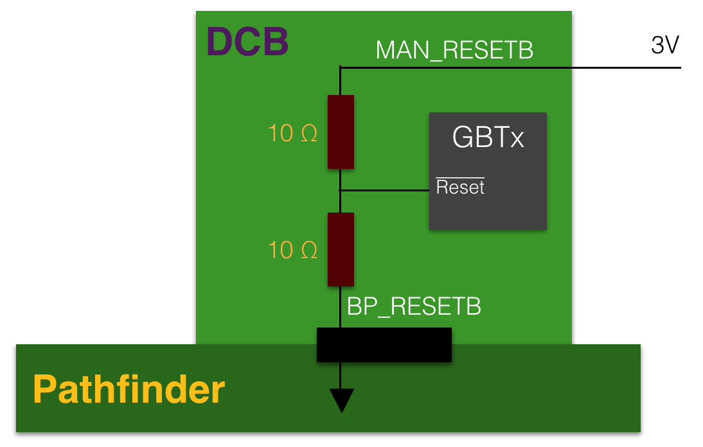
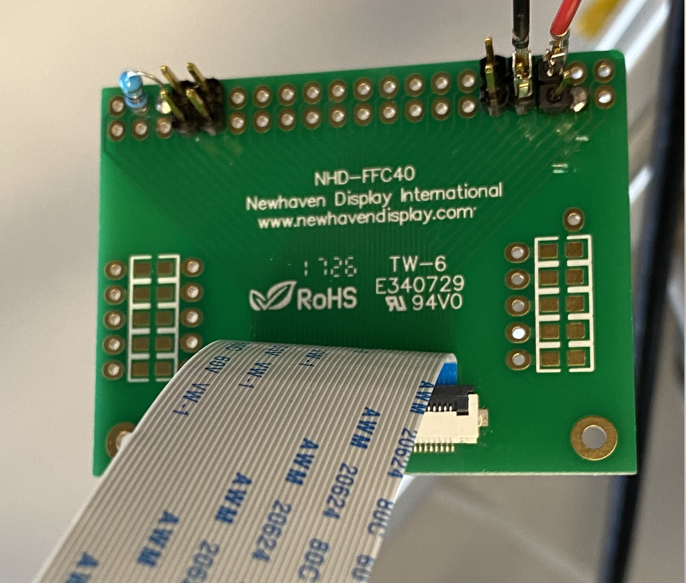

Production DCBs have an additional input to the master GBTx reset
(`BP_MC_EC_RESETB`) coming from pin `H43` on the backplane connector. This pin
is grounded in the Pathfinder, and since the `RESETB` is active low, the DCB was in
continuous reset.

We fixed this issue by providing 3V through the manual reset `MAN_MC_EC_RESETB`,
which comes out to the FFC breakout board connected to the optical mezzanine.
As shown in the circuit below, the 3 V is divided to 1.5 V at the GBTx input
and the DCB worked fine.

Here's a schematic on how a 3 V pull-up would work:

Here's the actual modification needed on the FFC breakout board:

!!! warning
    Check the **orientation** of the FFC cable! They may be different between
    Maryland's and CERN's.

    If they are different, the **bottom-left** becomes **top-right**.
