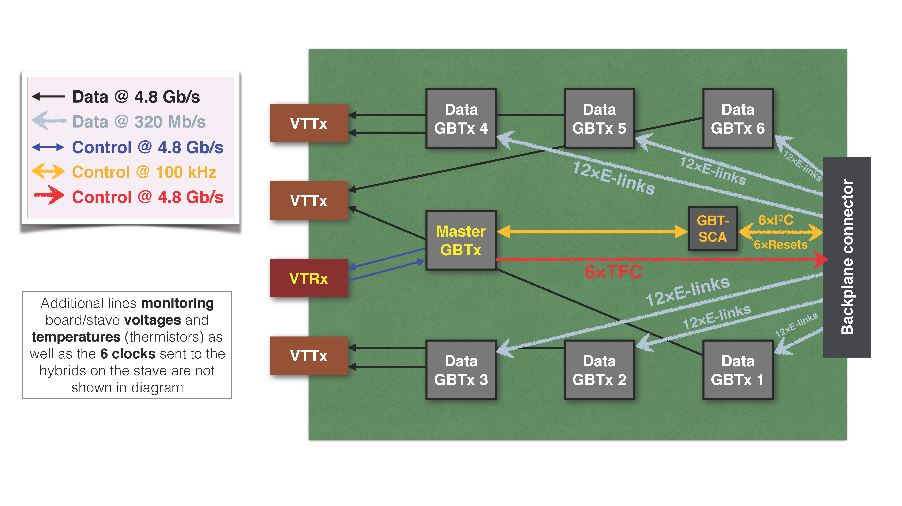
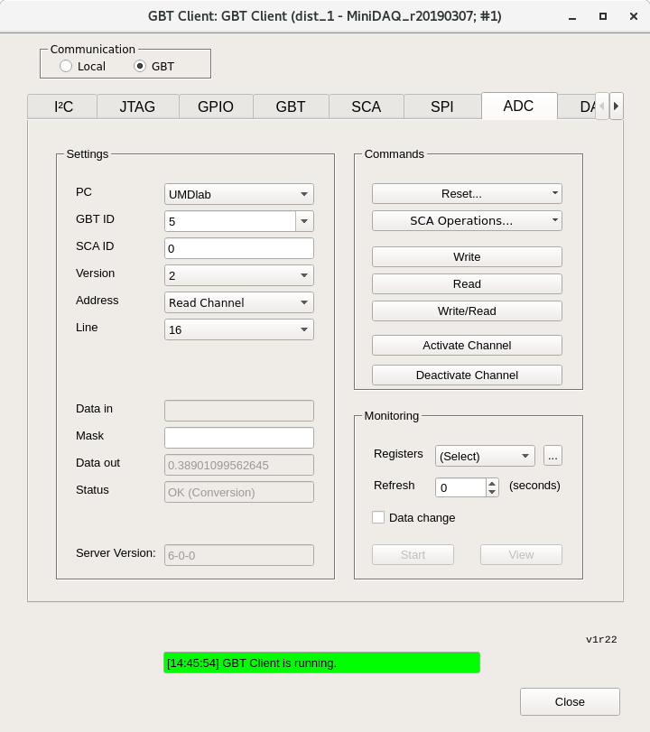

The DCB has a few purposes; aggregating data, controlling 
the stave, and monitoring. It has 4 optical mezzanines with 3 VTTxs and 1 VTRx, 
as well as 1 master GBTx, 1 GBT-SCA, and 6 data GBTxs. The DCB talks to the 
stave through the Backplane connecter and a computer through the mezzanines.

 

The PRBS test checks the DCB ability to get data from the GBTxs to the 
computer. A psuedo-random bit sequence, or PRBS, is generated in the data GBTxs
and sent to our computer via the VTTxs. This test verifies the black data lines
on the image.

In the SALT test, we tell the stave what data to send to the DCB to check the 
grey data lines. Each line represents 12 E-links connecting the stave to the 
GBTxs. For our tests, we have the stave sending "c4" repeated to the DCB. It 
is easy for this to get out of phase, which is why we accept any stable data 
in the memory monitor as a success. To see possible out-of-phase responses, 
you can break "c4" into 8bit binary, shift it one bit left or right, then 
make it hex again. 

We check the DCB control of the stave using the TFC test. 

There are also ADCs (analog to digital converters) we look at to verify the 
power and, for the ones attached to thermistors, monitor the temperature on 
the DCB itself and the stave.

## Setting up DCB

!!! warning
	Make sure you are grounded at all times when handling the DCB!
	
1. Verify the backplane connector. Do not plug in if its pins are bent, as it 
   can break the backplane.

2. Verify optical mezzanines are attached. They should rest on the long hex 
   nuts, but it is not necessary to screw in the mezzanines to the long hexes.
   
3. Attach optical fibers to the mezzanines. Two fibers go into each board. They
   should be sequential except for the two attached fibers which go to the
   master. 
	- The order should be something like 1, 2, Masters, 3, 4, 5, 6
	
4. Correct slot based on stave connection, Not sure if this is a necessary step
	- will either be JD10 or JD11

5. Slide DCB into the proper slot using the heat spreader pipes as handles. 
   Let it gently go down until until the guide rails at the bottom go in and 
   the DCB sits correctly. Then push until it clicks in.
   
## Checking Power

There are 3 seperate power lines, for the DCB, the VTTx's, and the Stave. They 
should not be moved or changed over the course of this QA, but it is good to 
verify the connections are correct.

- DCB
	1. Power comes to pairs of boards as labeled by the slot they are put in. 0
	   and 1, 2 and 3, etc...
	2. Cables are labeled `DCB-A` source & return and `DCB-B` source & return. A 
	   goes to the even board of a pair, slot JD10, and B goes to the odd board, 
	   JD11.
	3. `SRC` connects to the hevily labeled wire and `RET` connects to ground.

- VTTx	
	1. Similar power setup to DCB, one set `VTTx M` and the other just `VTTx`
	   with each having a `SRC` and `RET`.
	2. It doesn't matter which set gets connected to the inputs, as long as the 
	   sets are kept together.
	3. Connection is the same as DCB, `SRC` goes to the heavily labeled wire and
	   `RET` goes to ground.

- Stave
	1. There's P1, P2, P3, and P4 which each have `SRC` and `RET`. Make sure 
	   `P1 SRC` goes to `P1 SRC` and so on for all 8 wires.
	   
## Fusing GBTx

First, connect the usb dongle to the master optical mezzanine. 

!!!note 
	check this is right, add pic if so
 

1. Open the **GBTX Programmer** on the windows PC

2. Click **Import Image** and load the config file, it should be called 
   something like `master.txt`

3. Click **Write GBTX** then click **Read GBTX**
	- It should return a value similar to 
	> Idle, 18'h

 
On the Linux computer, we'll use nanoDAQ which gives some MiniDAQ functions 
in Python. Go to `$HOME/src/nanoDAQ` in a command line on the server to use. 
Also open MiniDAQby going to **Applications**, **WinCC**, 
**Project Administrator**, then double click on the top project.

## Programming Data GBTxs

There are 6 data GBTxs on each DCB, and these must be programed everytime the 
board gets power cycled.

!!!note
	NanoDAQ has some documentation [here.](https://github.com/umd-lhcb/nanoDAQ/blob/master/README.md)
	  A pdf that goes over a lot of MiniDAQ and GBTx usage can be downloaded
	[here.](https://github.com/umd-lhcb/gbtx_brds_doc/releases/download/0.8.5/gbtx_brds_doc.pdf)
1. In the nanoDAQ command prompt, we're going to pull the reset, also called 
   gpio, low and try to program it then high and try to program it. 
   
2. First, enter `./dcbutil.py gpio --reset 0 1 2 3 4 5 6 --final_state low` to
   pull all resets low. Then attempt to program the GBTxs with 
   `./dcbutil.py init ./gbtx_config/slave-Tx-wrong_termination.txt -g 0`
	- You should get an error

3. Now do the reverse by changing --final_state to high to enter 
   `./dcbutil.py gpio --reset 0 1 2 3 4 5 6 --final_state high` You should now
   be able to program the GBTxs with the command you inputted earlier.
   
## PRBS Test

!!!note
	This is the MiniDAQ "Top" panel that is referenced a couple times. Most 
	menus can be found starting from this panel.

1. To start PRBS, go to the nanoDAQ command line and enter `./dcbutil.py prbs on`

2. Open the PRBS panel by going to the top MiniDAQ hardware panel and clicking 
   **PRBS**. 
	- In the top left of the panel, click in order:  
	  Stop All Generators → Stop All Checkers → Reset All Counters →   
	  Start All Generators → Start All Checkers → Start All Counters

	

3. Allow test to run for **1-5 minutes**. It passes if there are 6 green channels 
   shown on the PRBS panel.
	- The picture shows 6 red ones. These are the correct channels and should be 
	  green if everything passes
   
4. Check if the DCB can regain lock by unplugging the master optical fibers then
   plugging them back in. Remember, master are the ones connected. 
	- Enter `./dcbutil.py prbs off` in the nanoDAQ command line. No output is a
	  success, otherwise it will report "Master GBT not locked"
	
## SALT Testing

For this step, we need to open the **Memory Monitoring** panel in MiniDAQ. In 
the Top panel, double click **DAQ** to open a new window, then keep double 
clicking **TELL40** until the following panel shows up, with the tab for 
**Memory Monitoring** on the right.

!!!note
	The last **TELL40** has a suffix, it doesn't matter which one you double 
	click.

1. In nanoDAQ, type in the command `./dcbutil.py gpio --reset 0 1 2 3 4 5 
   --final_state low` 
	- Now type `./saltutil.py [I2C] read 0 0 1` replacing the \[I2C\] with 3, 
	  4, and 5 if the DCB is in slot JD10.
	- Replace with 0, 1, 2 if the DCB is in slot JD11
	- You have to enter this command 3 times, once for each number.

2. If it is working correctly you'll get an error. Then repeat the process 
   but change the final state to high. You should get a result.
	- `./dcbutil.py gpio --reset 0 1 2 3 4 5 --final_state high` 
	

3. The following is for a DCB in slot JD10 only
	1. Start with `./saltutil.py 4 init` for I2C 4
	2. Type `./dcbutil.py init ~/bin/tmp_0.xml -s 1` to work with GBT 1
	3. Go to the memory monitoring panel and select link 22 at the top
		- Verify that **Write Address Memory** on the right changes values every
		  couple seconds and **Write Signal Status** is green.
	4. Now look at the table, focusing on the latter 3 columns. There are 8 
	   digits in each column. If they are NOT stable values, 
	   go to nanoDAQ and type `./dcbutil.py init ~/bin/tmp_1.xml -s 1`
		- keep incrementing the `tmp_*.xml` until the values are stable.
	5. Repeat this process starting with `./saltutil.py 3 init` followed by 
	   `./dcbutil.py init ~/bin/tmp_0.xml -s 2`
		- Link Selection must be on 12 now
		- When incrementing `tmp_*.xml` keep using "-s 2"
	6. Repeat again with `./saltutil.py 5 init` followed by 
	   `./dcbutil.py init ~/bin/tmp_0.xml -s 6`
		- Link Selection must be on 13

!!!note
	Refer to this table if instructions are unclear as to what numbers you 
	should be using.  
| Slot 	| GBT	| I2C	| Link Selection |
| :--:	| :--:	| :--:	| :--:	|
| JD10	|	1	|	4	|	22	| 
| JD10	|	2	|	3	|	12	|
| JD11	|	3	|	2	|	23	|
| JD11 	|	4	|	1	|	21	|
| JD11 	|	5	|	0	|	14	|
| JD10	|	6	|	5	|	13	|

4. The following is for a DCB in slot JD11 only
	1. Start with `./saltutil.py 2 init` for I2C 2
	2. Type `./dcbutil.py init ~/bin/tmp_0.xml -s 3` to work with GBT 3
	3. Go to the memory monitoring panel and select link 23 at the top
		- Verify that **Write Address Memory** on the right changes values every
		  couple seconds and **Write Signal Status** is green.
	4. Now look at the table, focusing on the latter 3 columns. There are 8 
	   digits in each column. If they are NOT stable values, 
	   go to nanoDAQ and type `./dcbutil.py init ~/bin/tmp_1.xml -s 3`
		- keep incrementing the `tmp_*.xml` until the values are stable.
	5. Repeat this process starting with `./saltutil.py 1 init` followed by 
	   `./dcbutil.py init ~/bin/tmp_0.xml -s 4`
		- Link Selection must be on 21 now
		- When incrementing `tmp_*.xml` keep using "-s 4"
	6. Repeat again with `./saltutil.py 0 init` followed by 
	   `./dcbutil.py init ~/bin/tmp_0.xml -s 5`
		- Link Selection must be on 14

## TFC Test

1. Type `./saltutil.py [I2C] ser_src tfc` replacing the \[I2C\] with 3, 4, and 5 
   if the DCB is in slot JD10.
	- Replace with 0, 1, 2 if the DCB is in slot JD11
	
2. Look in memory monitoring again and select links based on slot
	- Same as SALT. JD10 gets links 22, 12, and 13. JD11 gets links 23, 21, and 
	  14

3. The values in the table should be something similar to 01, 02, 04, or 08
   repeating 

## ADC Read Out

If there is no MiniDAQ panel called **GBT Client** already open, open it by
going back to the MiniDAQ UI (the one with "Gedi" in its title) and under 
**LHCB Framework**, click **GBT Client**. Choose GBT under Communication on 
the top left. Now navigate to the **ADC** tab.

1. Configure settings as follows - PC: UMDlab, GBT ID: 0, SCA ID: 0, Version: 2
	- For now, set address to "Read Channel" and line to 24 then 25. Clicking 
	  read on the right updates the "Data out" field.
	- Line 24 should be around 0.5 and line 25 should be around 0.
	- If you're getting an error, try clicking "Activate Channel" then try again
	
2. When looking in slot JD10
	- Also read out lines 5, 6, and 7. They should all be 0.55

3. When looking in slot JD11
	- Also read out lines 2, 3, and 4. They should all be 0.55
	
4. Change address to "Current Source" and put `FFFFFFFF` (8 Fs) in "Data in", 
   then click read/write

5. Put address back to "Read Channel" and check lines 0, 1, 16, 17, and 18 by 
   clicking read and looking at "Data in"
	- Line 0 expected value is 0.53
	- Other lines expected value 0.15
