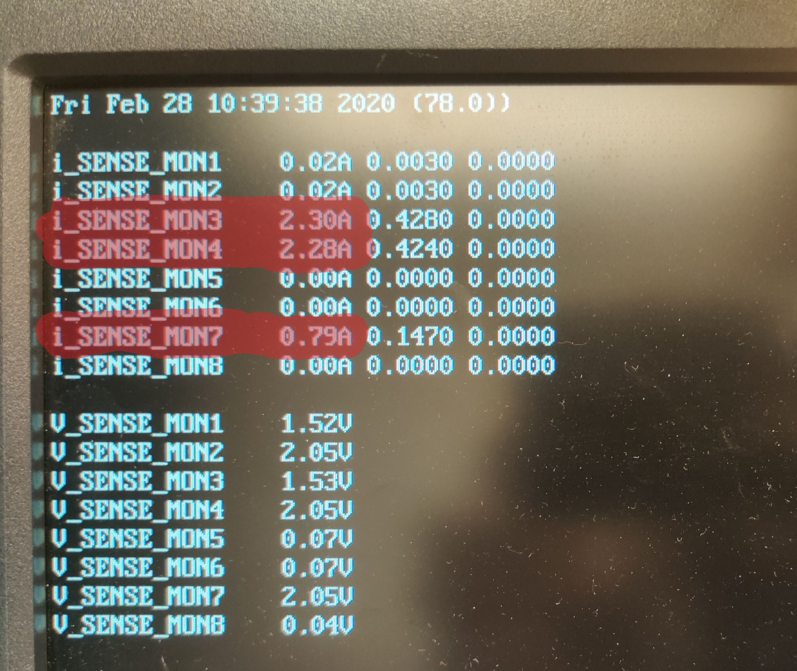
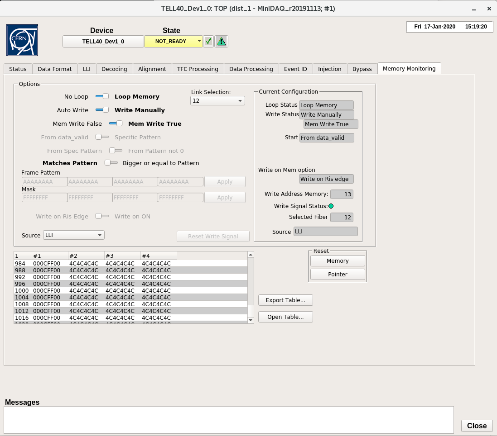

!!! warning
    Make sure you are grounded at all times when handling the DCB! Failing to
    do so could destroy the boards!

The DCB has a few purposes; aggregating data, controlling
the stave, and monitoring. It has 4 optical mezzanines with 3 VTTxs and 1 VTRx,
as well as 1 master GBTx, 1 GBT-SCA, and 6 data GBTxs. The DCB talks to the
stave through the Backplane connecter and a computer through the mezzanines.

The PRBS test checks the DCB ability to get data from the GBTxs to the
computer. A psuedo-random bit sequence, or PRBS, is generated in the data GBTxs
and sent to our computer via the VTTxs. This test verifies the black data lines
on the image.

In the SALT test, we tell the stave what data to send to the DCB to check the
grey data lines. Each line represents 12 E-links connecting the stave to the
GBTxs. For our tests, we have the stave sending `c4` repeated to the DCB. It
is easy for this to get out of phase, which is why we accept any stable data
in the memory monitor as a success. To see possible out-of-phase responses,
you can break `c4` into 8bit binary, shift it one bit left or right, then
make it hex again.

We check the DCB control of the stave by testing TFC loopback, where a GBTx
sends a header of `04` to the stave. We know the E-links will be good as they have
just been checked, so we expect to see the stave repeating 04 back to us if
everything is working correctly. It is also fine here to see a bit-shift,
making it look like the stave is repeating `01`, `02`, or `08`.

There are also ADCs (analog to digital converters) we look at to verify the
power and, for the ones attached to thermistors, monitor the temperature on
the DCB itself and the stave.

!!! note
    Make sure to keep the [database](https://docs.google.com/spreadsheets/d/1KjXGhOFzi0SZPsozpKzxGjVtfr4kkS_Hv5EigUwKOj8/edit "Database")
    up to date as you go through the tests.

## Fusing GBTx

!!! warning
    If the DCB has already gone through the burn-in, skip fusing and go straight
    to "[Setting up DCB](dcb_qa.md#setting-up-dcb)"

Verify the jumper on **`J2`**, next to the optical mezzanines, looks like this

There will already be an optical mezzanine connected to a dongle that you need
to attach to the DCB. It goes over the outline with the label `OMDBMC`. Don't
worry about screwing it in, this is a temporary setup.

On the left of the picture is a different power breakout board that must also
be attached. Its powered by two 1.5 volt connections with amp limit 2.5 and one
3.3 volt connection with amp limit 0.5, the power setup should look like the
picture below. Power on the DCB.

1. Open the **GBTX Programmer** on the windows PC. If it's not already open you
   can find it under `D:/Users/DT_Rack/GBTx_Programmer` as a jar file called
   `programmerv2.20180725.jar`.

2. Check the connection is working by clicking **Read GBTX**, the state should
   change to `pauseForConfig`

3. Go to the **Fuse my GBTx** tab all the way on the right
    - click **Import Image**, make sure you can see .txt files, and select
      `master.txt`
    - click **Write GBTX** then **Read GBTX**, the state should change to
      `waitDESLock`
    - to the right of table, find and click update view. All of the entries in
      the table should now be green
    - Now check **enable fusing** and
      **fuse updateConfig**, and click the big **FUSE** button at the bottom

        !!! note
            Register 365 should not be checked and fused.

4. Shut off power to the DCB and move the right jumper on **`J2`** up one to be
   in-line with the other jumper.

    

5. To verify the fuse was successful, power the DCB back on.
    - in the **GBTX Programmer**, read and update view like before. The table
      should still be all green

6. Add a red jumper to connector **`J4`** as shown
    

7. Take off the mezzanine with the dongle and attach all 4 of the mezzanines
   that came with the DCB. Make sure the red VTRx mezzanine goes on the
   connector `OMDBMC`

## Setting up DCB

1. Verify the backplane connector. Do not plug in if its pins are bent, as it
   can break the backplane.

2. Verify optical mezzanines are attached. They should rest on the long hex
   nuts.

3. Attach optical fibers to the mezzanines. Two fibers go into each board. They
   should be sequential except for the two attached fibers which go to the
   master.
    - The order should be something like 1, 2, Masters, 3, 4, 5, 6

4. Correct slot based on stave connection
    - will either be **`JD10`** (for stave **`JP8`**) or **`JD11`** (for stave **`JP11`**)

5. Slide DCB into the proper slot using the heat spreader pipes as handles.
   Let it gently go down until until the guide rails at the bottom go in and
   the DCB sits correctly. Then push until it clicks in.

## Checking Power

There are 3 separate power lines, for the DCB, the VTTx's, and the Stave. They
should not be moved or changed over the course of this QA, but it is good to
verify the connections are correct.

- DCB
    1. Power comes to pairs of boards as labeled by the slot they are put in. 0
       and 1, 2 and 3, etc...
    2. A set of 8 cables are split into groups of 4 labeled `DCB-A` and `DCB-B`.
       The sets are broken down into two more sets of two; a master and slave
       (labeled M and S) which each have a source and return.
        - A goes to the even board of a pair, slot **`JD10`**, and B goes to the odd
          board, **`JD11`**.
        - It does not matter which wire gets the masters and which gets the
          slave
    3. `SRC` connects to the wire labeled 1v5 and `RET` connects to ground for
       all 4 pairs.

- VTTx
    1. There is a set of power and ground cables labeled `2v5 VTTX CH 3` and
       `RET` that we'll connect to a set of wires with a tag "JD10/11"
    2. The `2v5 VTTX` cable connects to the wire labeled 2v5 and `RET` goes to
       ground.

- Stave
    1. There's P1, P2, P3, and P4 which each have `SRC` and `RET`. Make sure
       `P1 SRC` goes to `P1 SRC` and so on for all 8 wires.

!!! note
    On the Linux computer, we'll use nanoDAQ which gives some MiniDAQ functions
    in Python. Go to `$HOME/src/nanoDAQ` in a command line on the server to use.
    Also open MiniDAQ by going to **Applications**, **WinCC**,
    **Project Administrator**, then double click on the top project.

## Programming Data GBTxs

There are 6 data GBTxs on each DCB, and these must be programed every time the
board gets power cycled.

!!!note
    `nanoDAQ` has some documentation [here](https://github.com/umd-lhcb/nanoDAQ/blob/master/README.md).

    A pdf that goes over a lot of MiniDAQ and GBTx usage can be downloaded
    [here](https://github.com/umd-lhcb/gbtx_brds_doc/releases/download/0.8.5/gbtx_brds_doc.pdf).

1. In the `nanoDAQ` command prompt, we're going to pull the reset, also called
   GPIO, low and try to program it then high and try to program it.

2. First, enter `./dcbutil.py gpio --reset 0 1 2 3 4 5 6 --final_state low` to
   pull all resets low. Then attempt to program the GBTxs with
   `./dcbutil.py init ./gbtx_config/slave-Tx-wrong_termination.txt -g 0`
    - You should get an error

3. Now do the reverse by changing --final_state to high to enter
   `./dcbutil.py gpio --reset 0 1 2 3 4 5 6 --final_state high` You should now
   be able to program the GBTxs with the command you inputted earlier.

## PRBS Test

!!!note
    This is the MiniDAQ "Top" panel that is referenced a couple times. Most
    menus can be found starting from this panel.

    

1. To start PRBS, go to the nanoDAQ command line and enter `./dcbutil.py prbs on`

2. Open the PRBS panel by going to the top MiniDAQ hardware panel and clicking
   **PRBS**.
    - In the top left of the panel, click in order:  
      Stop All Generators → Stop All Checkers → Reset All Counters →   
      Start All Generators → Start All Checkers → Start All Counters

    

3. Allow test to run for **1-5 minutes**. It passes if there are 6 green channels
   shown on the PRBS panel.
    - The picture shows 6 red ones. These are the correct channels and should be
      green if everything passes

4. There is a screen above the power switch that shows some readout values for the
   lvr. In the top left chunk, we care about the values of `i_SENSE_MON3`,
   `i_SENSE_MON4`, and `i_SENSE_MON7`.
    - Add the values from 3 and 4 together and record it on the database under
      "1.5V current[A]"
    - Record the value from 7 on the database under "2.5V current[A]"

    

5. Check if the DCB can regain lock by unplugging the master optical fibers then
   plugging them back in. Remember, master are the ones connected.
    - Enter `./dcbutil.py prbs off` in the nanoDAQ command line. No output is a
      success, otherwise it will report "Master GBT not locked"

!!! warning
    **Stop here if the DCB has NOT gone through the burn-in yet!!!**

## SALT Testing

The following three tests (SALT, TFC, and ADC) have different instructions
dependant on the slot the DCB is connected to, which is determined by the
stave connection. Each slot only tests half of the board. Remember **`JP8`**
goes to slot **`JD10`** and **`JP11`** goes to slot **`JD11`**. Changing the
stave connection is a process, so we'll test the same half on many boards,
then swap everything to check the other half.

!!! note
    Make sure to program the data GBTxs if the DCB has been powered off since
    doing so

For this step, we need to open the **Memory Monitoring** panel in MiniDAQ. In
the Top panel, double click **DAQ** to open a new window, then keep double
clicking **TELL40** until the following panel shows up, with the tab for
**Memory Monitoring** on the right.

!!!note
    The last **TELL40** has a suffix, click on the first **Dev1_0**

1. In `nanoDAQ`, type in the command `./dcbutil.py gpio --reset 0 1 2 3 4 5
   --final_state low`
    - Now type `./saltutil.py [I2C] read 0 0 1` replacing the `[I2C]` with `3`,
      `4`, and `5` if the DCB is in slot **`JD10`**.
    - Replace with `0`, `1`, `2` if the DCB is in slot **`JD11`**
    - You have to enter this command 3 times, once for each number.

2. If it is working correctly you'll get an error. Then repeat the process
   but change the final state to high. You should get a result.
    - `./dcbutil.py gpio --reset 0 1 2 3 4 5 --final_state high`

3. The following is for a DCB in slot **`JD10`** only
    1. Start with `./saltutil.py 4 init` for I2C 4
    2. Type `./dcbutil.py init ~/bin/tmp_0.xml -s 1` to work with GBT 1
    3. Go to the memory monitoring panel and select link 22 at the top
        - Verify that **Write Address Memory** on the right changes values every
          couple seconds and **Write Signal Status** is green.
    4. Now look at the table, focusing on the latter 3 columns. There are 8
       digits in each column. If they are NOT stable values,
       go to `nanoDAQ` and type `./dcbutil.py init ~/bin/tmp_1.xml -s 1`
        - keep incrementing the `tmp_*.xml` until the values are a stable bit
          shift of `c4`.
    5. Repeat this process starting with `./saltutil.py 3 init` followed by
       `./dcbutil.py init ~/bin/tmp_0.xml -s 2`
        - Link Selection must be on 12 now
        - When incrementing `tmp_*.xml` keep using `-s 2`
    6. Repeat again with `./saltutil.py 5 init` followed by
       `./dcbutil.py init ~/bin/tmp_0.xml -s 6`
        - Link Selection must be on 13

    !!!note
        Refer to this table if instructions are unclear as to what numbers you
        should be using.

        | Slot   | GBT  | I2C  | Link Selection |
        | :--:   | :--: | :--: | :--:           |
        | `JD10` |    1 |    4 |   22           |
        | `JD10` |    2 |    3 |   12           |
        | `JD11` |    3 |    2 |   23           |
        | `JD11` |    4 |    1 |   21           |
        | `JD11` |    5 |    0 |   14           |
        | `JD10` |    6 |    5 |   13           |

4. The following is for a DCB in slot **`JD11`** only
    1. Start with `./saltutil.py 2 init` for I2C 2
    2. Type `./dcbutil.py init ~/bin/tmp_0.xml -s 3` to work with GBT 3
    3. Go to the memory monitoring panel and select link 23 at the top
        - Verify that **Write Address Memory** on the right changes values every
          couple seconds and **Write Signal Status** is green.
    4. Now look at the table, focusing on the latter 3 columns. There are 8
       digits in each column. If they are NOT stable values,
       go to `nanoDAQ` and type `./dcbutil.py init ~/bin/tmp_1.xml -s 3`
        - keep incrementing the `tmp_*.xml` until the values are a stable bit
          shift of `c4`.
    5. Repeat this process starting with `./saltutil.py 1 init` followed by
       `./dcbutil.py init ~/bin/tmp_0.xml -s 4`
        - Link Selection must be on 21 now
        - When incrementing `tmp_*.xml` keep using `-s 4`
    6. Repeat again with `./saltutil.py 0 init` followed by
       `./dcbutil.py init ~/bin/tmp_0.xml -s 5`
        - Link Selection must be on 14

## TFC Test

1. Type `./saltutil.py [I2C] ser_src tfc` replacing the `[I2C]` with `3`, `4`,
   and `5` if the DCB is in slot **`JD10`**.
    - Replace with `0`, `1`, `2` if the DCB is in slot **`JD11`**

2. Look in memory monitoring again and select links based on slot
    - Same as SALT. **`JD10`** gets links 22, 12, and 13. **`JD11`** gets links
      23, 21, and 14

3. The values in the table should be something similar to 01, 02, 04, or 08
   repeating

## ADC Read Out

If there is no MiniDAQ panel called **GBT Client** already open, open it by
going back to the MiniDAQ UI (the one with "Gedi" in its title) and under
**LHCB Framework**, click **GBT Client**. Choose GBT under Communication on
the top left. Now navigate to the **ADC** tab.

1. Configure settings as follows
    - **PC**: UMDlab, **GBT ID**: 0, **SCA ID**: 0, **Version**: 2
    - For now, set address to **Read Channel** and **Line** to 24, then 25,
      then 0. Clicking read on the right updates the **Data out** field.
    - Line 24 should be around 0.83 and line 25 should be around 0.5
    - Line 0 should be around 0.53
    - If you're getting an error, try clicking **Activate Channel** then try again

2. When looking in slot **`JD10`**
    - Also read out lines 5, 6, and 7. They should all be 0.55

3. When looking in slot **`JD11`**
    - Also read out lines 2, 3, and 4. They should all be 0.55

4. Change address to **Current Source** and put `ffffffff` (8 `f`s) in **Data in**,
   then click **read/write**

5. Put address back to **Read Channel** and check lines 1, 16, 17, and 18 by
   clicking read and looking at **Data in**
    - Expected value 0.15

## Optical to Master GBT

We want to verify that we can communicate to the Master GBTx through the
optical fibers. Make sure **GBT Client** is still open, and go to the tab
labeled **GBT**.

1. Verify or add a red jumper cable to the first connection from **`J4`** on
   the DCB, directly under an optical mezzanine. It is also labeled
   `MC CONFIGSELECT`

   

2. Set up **GBT Client** such that **GBT ID**: 0, **Device Address**: 7,
   **Register Address**: 28, Size: 1
    - Click Read on the right and you should see `00` in **Data out**

3. Put `ff` in **Data in** and click **read/write**
    - **Data out** should now read `ff`
