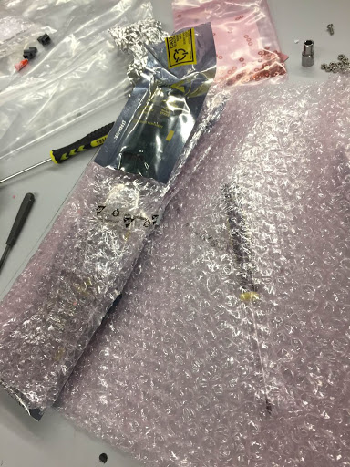
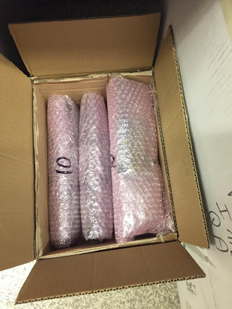
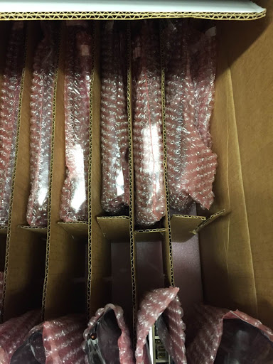

## Shipping procedure:

## Mezzanines

Remove mezzanines from DCB.  Screws can go in a pile for later use for now.

Put mezzanine in ESD bag.  *Note: we are not sealing the ESD bags for now.*

Wrap bags in bubble wrap in the same way they arrived:

Seal the side and both ends of the bubble wrap with packing tape.  *Note: this is not ESD safe tape, but it is outside the ESD bags.*

Stack the packed mezzanines in whatever boxes are available:

*Note: using mechanics and Amazon boxes, may need to order speficic boxes or just claim a few large ones.*

## DCBs 
Much more speculative.  Here are some things to think about:

*Note: The DCB boxes could hold 16 DCBs, but the first one I packed only had enough cardboard dividers for 14.  This means two DCBs would be touching the outer wall of the box.  We could add cardboard or foam to protect them, or just ship 14.*

*Note: The DCBs are a little loose in the cardboard honeycomb, we could try to fit one more sheet of bubble wrap in if we have it. 

Make sure there is a layer of pink foam at the bottom of the box.  Remove one of the two short dividers and move the other to the middle of the box to fit the assembled DCB.

After removing the optical mezzanines (above) close the ESD bag, remove the white strip from the bubble wrap bag and seal it.  Add a sheet of bubble wrap if there is enough space (might need to buy some).

Make sure the outer DCBs at the edges of the honeycomb are well protected with bubble wrap, and possibly additional cardboard.
