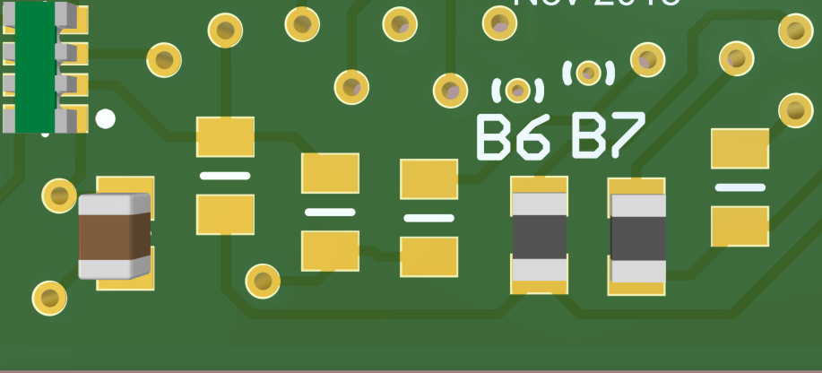

CCM identification field guide
========================================

Identification of a CCM of unknown configuration can be broken down into two parts: identifying the intended output voltage (1.2, 1.5, or 2.5 Volts = 12, 15, 25) and identifying whether it is a stand-alone single master (A), a master with support for a slave (M), or a slave (S). Here we'll call these Output Level and Role, respectively.

Identifying Output Level
------------------------

To identify the output voltage of an unknown CCM, first inspect closely the potentiometer (POT-1). There is a 'B' logo, several arrows for benchmark points, and a 3-digit number (see picture). The three digit number may be used to identify the intended output voltage:

  - 104 = 1.2V output
  - 203 = 1.5V output
  - 502 = 2.5V output

Identifying the CCM Role
------------------------

To identify whether the type is (M)aster, (S)lave or (A)lone (a.k.a. single master), inspect the 6 resistors on the bottom of the CCM (bottom here defined when the CCM is oriented such that the text is readable). From left to right, if we denote an empty pad by 0 and a populated resistor by 1, we have:

  - Subtype A, single master - \[0,0,0,1,1,0\]
  

  - Subtype M, master - \[0,1,0,1,1,0\]
  

  - Subtype S, slave - \[1,0,1,0,0,1\]
  

Example CCM
-----------

An example identification is shown in the picture.

