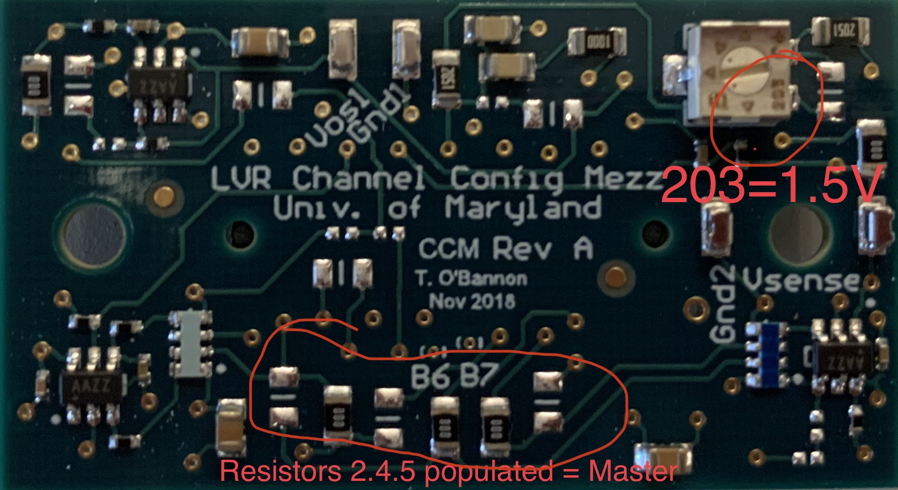

# CCM identification field guide

Identification of a CCM of unknown configuration can be broken down into two
parts: identifying the intended output voltage (1.2, 1.5, or 2.5 Volts = 12,
15, 25) and identifying whether it is a stand-alone single master (A), a master
with support for a slave (M), or a slave (S). Here we'll call these Output
Level and Role, respectively.

## Identifying Output Level

To identify the output voltage of an unknown CCM, first inspect closely the
potentiometer (POT-1). There is a 'B' logo, several arrows for benchmark
points, and a 3-digit number (see picture). The three digit number may be used
to identify the intended output voltage:

| Code | Voltage output [V] |
|------|--------------------|
| 104  | 1.2                |
| 203  | 1.5                |
| 502  | 2.5                |

## Identifying the CCM Role

To identify whether the type is (M)aster, (S)lave or (A)lone (a.k.a. single
master), inspect the 6 resistors on the bottom of the CCM (bottom here defined
when the CCM is oriented such that the text is readable). From left to right,
if we denote an empty pad by 0 and a populated resistor by 1, we have:

| Type                                       | Image                                                         |
|--------------------------------------------|---------------------------------------------------------------|
| Subtype A, single master - \[0,0,0,1,1,0\] |  |
| Subtype M, master - \[0,1,0,1,1,0\]        |  |
| Subtype S, slave - \[1,0,1,0,0,1\]         |  |

## Example CCM

An example identification is shown in the picture.

# CCM Test Stand Configuration

Configuring the CCM test stand is a 3 staged process. This involves configurnig the test stand based on if the CCM being used is 12, 15, 25, and MS or A.

## Stage 1: Load Board

The first stage involves selecting the appropriate load board to plug into the LVR output. There are two different load boards; one for MS and one for A CCMs, as shown in the figures below:

!!! info "Below shows the board used for MS CCMs, as well as where to plug it in
      
      

!!! info "Below shows the board used for A CCMs

    

## Stage 2: Capacitor Board

The second stage involves setting up the capacitor board. There are 2 different setting for the capacitor, each setting configuring the LVR for either MS or A CCMs. To configure MS CCMs, connect the left most cables on the capacitor board to the right most sockets, as shown in the figure below. In this case, the polarity does matter.

!!! info "Master-Slave CCM Capacitor Board configuration"

    
    
To configure A CCMs, connect the right most cables on the capacitor board to the right most sockets as shown below. Polarity of the cables does not matter in this case.

!!! info "Alone CCM Capacitor Board configuration"

    

## Stage 3: Resistor Bank

The third and final stage involves configuring the resistor bank shown in the figure below.

!!! info "Resistor Bank"

    

In this stage, you will be configuring the LVR to either 1.25, 1.5, or 2.5 V. In general, when considering voltage and resistance, each channel that you use has 2.1-2.6 A running through it. This means that for some CCM "XXA" the setup uses 2.1-2.6 A, and for some CCM "xxM + xxS", the setup would use 4.2-5.2 A.

When setting up the resistor bank, use jumpers to jump the resistor pins that you want. It does not matter how you jump the pins (since there are 3 per resistor) as long as the jumper goes over the middle pin.

The specific resistor board you must configure is shown in the figure above to have a large cable connected to it (first row middle column). On that resistor board, you will notice resistor pins arranged as shown below.

!!! info "Resistor Board"

    
    
Going from right to left, 
