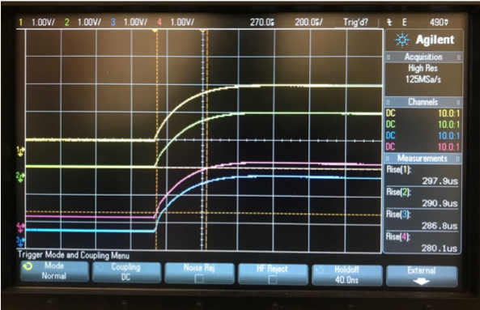
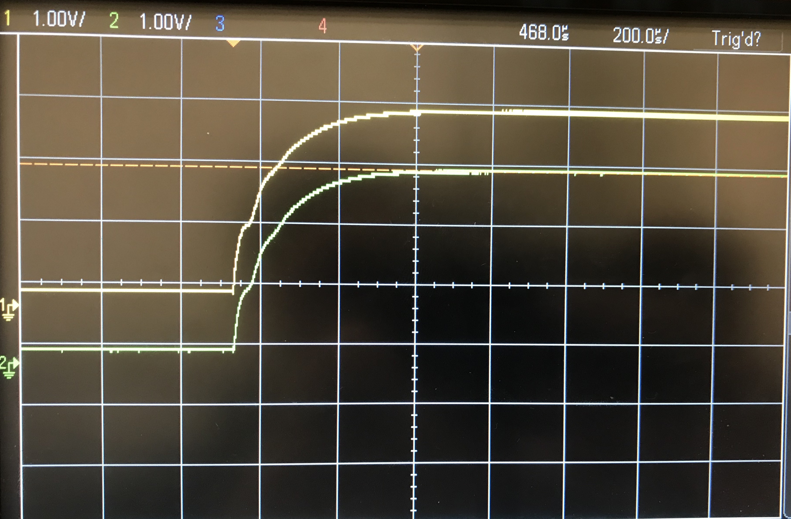

This procedure acts under the assumption that the user is utilizing the
pre-built CCM QA setup.

1. Turn on both oscilloscopes connected to the LVR
2. Take a master slave (MS) CCM pair, or take a single stand-alone master (A) CCM.
    1. If using an MS pair, validate that the pair are both either 1.2, 1.5, or 2.5 V

3. Install the CCM MS pair on channels 1 & 2 of the LVR, or install the A CCM in channel 1 and place a resistor in channel 2.

    !!! note "Note the following"
        In the case of an MS pair, you CANNOT install 2 masters or
        2 slaves on the same 2-channel pair

4. Set the input voltage of the power supply to ~5.5 V
5. Note the wave pattern on the first oscilloscope, displaying either 4
   distinct channels if using an MS pair or 2 channels for an A CCM.

    !!! note "Note the following"
        Note that channels 1 and 2 correspond to the master, where
        channels 3 and 4 correspond to the slave.

        

        This is an examlpe of a curve for a 1.5 MS CCM. The waveform displayed should be a
        smooth curve as shown in the figure above.

        

        This is an example of a curve for a 2.5 A CCM. The waveform displayed, you will note,
        has a slight oscillation. This is to be expected as this is just the representation of
        the turn-on voltage.

        

        This is an example of a curve for a 1.25 A CCM. The waveform displayed, you will note,
        has a slight oscillation. This is to be expected as this is just the representation of
        the turn-on voltage.

    !!! note "Note the following"
        In addition to similar shapes, ch1&2 (yellow and green)
        and ch3&4 (blue and red) (if slave is present) should converge
        to the same amplitude within +/- 3% or so. It may be useful to include a "top"
        voltage measurement on the display to do this easily.

6. Locate the variable resistor on the master CCM or the A CCM, and note the voltage
   reading on channel 1 of the second oscilloscope, denoted `Vtop`.

7. Adjust the variable resistor so the voltage reading of channel 1
   corresponds to the voltage of the CCM (i.e. a 1.5 V CCM should have
   a channel reading of ~1.5 V) as shown below for a 1.5 V CCM. For an A CCM, this
   will mean adjusting the variable resistor all the way to the left (counterclockwise).

    

8. After adjusting the variable resistor, go back to the first
   oscilloscope readings
9. If the waveform displayed is still not smooth, either set aside your A CCM, or note the following if using an MS pair:
    1. If the bottom two curves ONLY are not smooth, this indicates a
       problem with the slave

    2. If BOTH curves are not smooth, replace the master CCM with a
       validated master CCM with the same voltage identity.
        1. If after replacing the curve is smooth and normal, the
           previous master CCM has a problem
        2. If after replacing the bottom curve is not smooth, this
           indicates a problem with the previous master CCM and the
           current slave CCM

10. Once the CCM is fully QAd, place a colored dot labelling its type on the front of the CCM, and
    a numbered sticker on the back of the CCM to indicate its serial number.
    1. Once all CCMs in a roll are complete, place the CCMs back into the roll and label the roll
       as `XXY#`, where `XX` denotes the CCM type (i.e. `25, 15, 12`), `Y` denotes the pairing
       (`A, M, S`) and `#` denotes the serial number (`001, 002, ....`)
