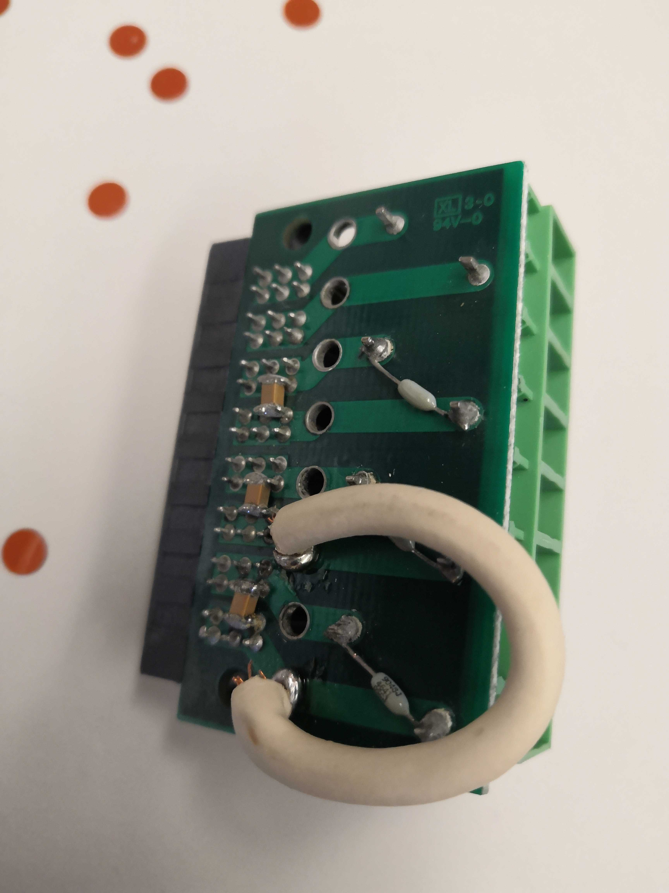
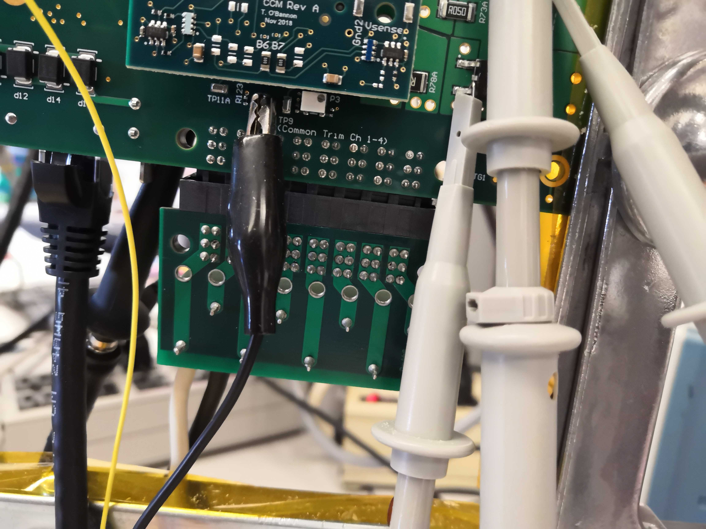
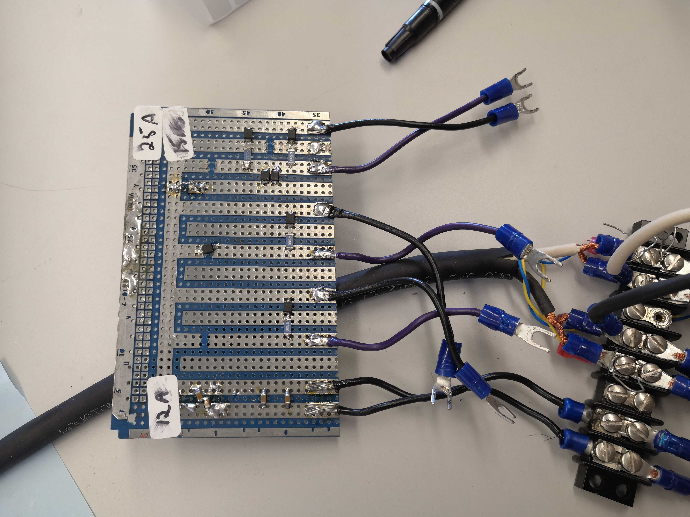
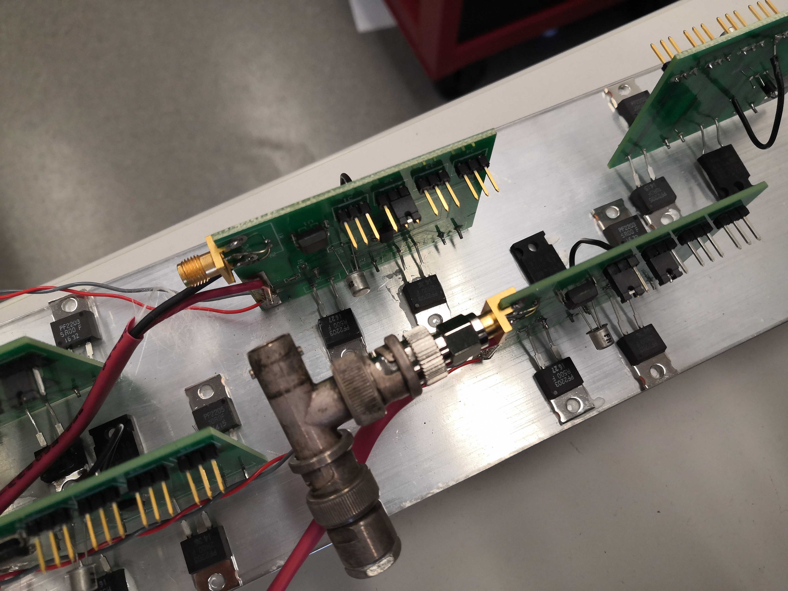
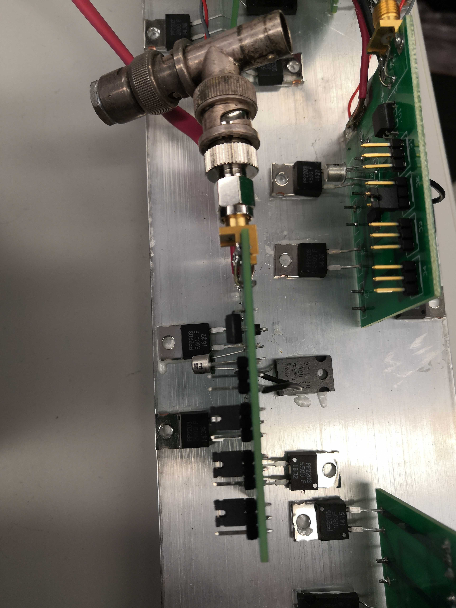
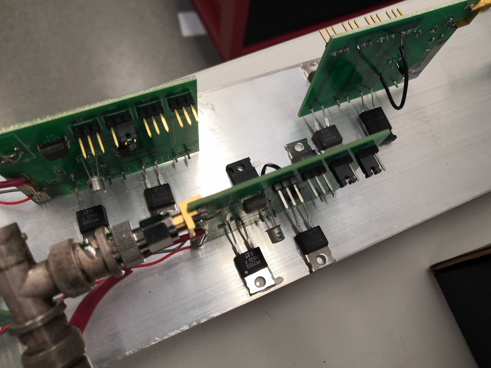
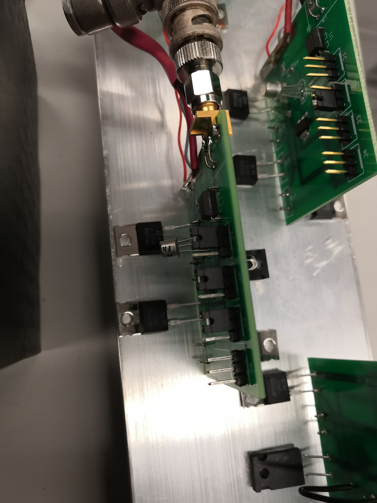
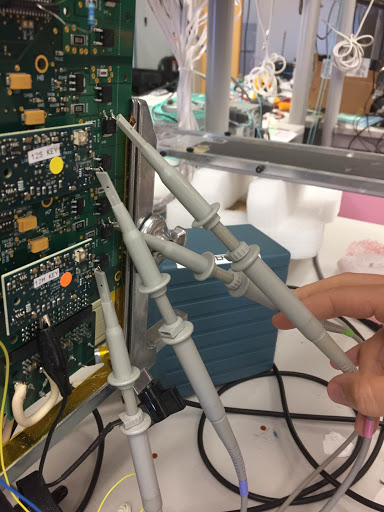

# CCM Test Stand Configuration

Configuring the CCM test stand is a 3 staged process. This involves configuring
the test stand based on if the CCM being used is `12, 15, 25`, and `MS` or `A`.

## Stage 1: Load Board

The first stage involves selecting the appropriate output board to plug into the
LVR output. There are two different output boards:

1. For `MS` CCMs

    !!! info "Output board for `MS` CCMs, and where to plug it in"

          

2. For `A` CCMs

    !!! info "Output board for `A` CCMs"

        

## Stage 2: Capacitor Board

The second stage involves setting up the capacitor board. There are 2 different
setting for the capacitor, each setting configuring the LVR for either 15MS/25A or 12A/12MS
CCMs as indicated in the picture below.

1. To configure `15MS` and `25A` CCMs, connect the right most cables on the capacitor board
    to the left most sockets, as labeled by the 25A and 15MS tags shown in the figure above.  Polarity matters, the purple cable is positive.
       
2. To configure `12A` and `12MS` CCMs, connect the left most cables on the capacitor board
    to the left most sockets as connected in the picture shown above.   Polarity does not matter.

   
## Stage 3: Resistor Bank

The third and final stage involves configuring the resistor bank.

In this stage, you will be configuring the LVR to either `1.25, 1.5`, or `2.5` V.

In general, when considering voltage and resistance, each channel that you use
has 2.0-2.5 A running through it.

- For some CCM `XXA`, the setup uses 2.0-2.5 A.
- For some CCM `xxM + xxS`, the setup would use 3.8-5.0 A.

When setting up the resistor bank, use jumpers to jump the resistor pins that
you want. It does not matter how you jump the pins (since there are 3 per
resistor) as long as the jumper goes over the middle pin.  The jumper activates the resistor, which is added in parallel.  Resistors are 0.5, 1, 2, and 5 Ohms.

1. To configure `15MS` CCMs, connect the resistors with jumpers as shown below.
    
        
2. To configure `12A` CCMs, connect the resistors with jumpers as shown below.
    
    
3. To configure `25A` CCMs, connect the resistors with jumpers as shown below.
    
    
4. To configure `12MS` CCMs, connect the resistors with jumpers as shown below.
    
    
## General CCM Test Stand Config:

Scope 1 should have channels 1 and 2 on.  Channel 1 is connected to the load board, channel 2 is connected to pins 1 and 2 of the output connector.

Scope 2 should have channels 1 and 2 on for A, all channels on for MS.  They are connected as shown

Channel 1/A is Master, 2/B is slave.

Unused channels should be disabled by switches or a resistor between pins 15 and 17.
    
