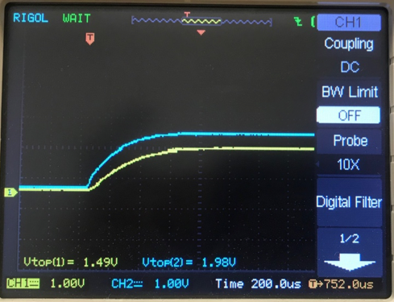

Foreword: CCM identification field guide
========================================

To identify the type of an unknown CCM, first inspect closely the potentiometer (POT-1). There is a 'B' logo, several arrows for benchmark points, and a 3-digit number (see picture). The three digit number may be used to identify the intended output voltage:

1. 104 = 1.2V output

2. 203 = 1.5V output

3. 502 = 2.5V output

To identify whether the type is (M)aster, (S)lave or (A)lone (a.k.a. single master), inspect the 6 resistors on the bottom of the CCM (bottom here defined when the CCM is oriented such that the text is readable). From left to right, if we denote an empty pad by 0 and a populated resistor by 1, we have:

1. Subtype A, single master - \[0,0,0,1,1,0\]

2. Subtype M, master - \[0,1,0,1,1,0\]

3. Subtype S, slave - \[1,0,1,0,0,1\]

An example identification is shown in the picture.

CCM QA Procedure
================

This procedure acts under the assumption that the user is utilizing the
pre-built CCM QA setup.

1.  Turn on both oscilloscopes connected to the LVR

2.  Take a master slave CCM pair

    a.  Validate that the pair are both either 1.2, 1.5, or 2.5 V

3.  Install the CCM master-slave pair on channels 1 & 2 of the LVR.

    a. Note that in the case of a master-slave pair, you CANNOT install 2 masters or 2 slaves 
    on the same 2-channel pair

4.  Set the input voltage of the power supply to \~5.5 V

5.  Note the wave pattern on the first oscilloscope displaying 4
    distinct channels.

    a.  Note that channels 1 and 2 correspond to the master, where
        channels 3 and 4 correspond to the slave.

The waveform displayed should be a smooth curve as shown in the figure above.

7.  Locate the variable resistor on the master CCM, and note the voltage
    reading on channel 1 of the second oscilloscope, denoted Vtop.

8.  Adjust the variable resistor so the voltage reading of channel 1
    corresponds to the voltage of the CCM (i.e. a 1.5 V CCM should have
    a channel reading of \~1.5 V) as shown below for a 1.5 V CCM

9.  After adjusting the variable resistor, go back to the first
    oscilloscope readings

10. If the waveform displayed is still not smooth, note the following

    a.  If the bottom two curves ONLY are not smooth, this indicates a
        problem with the slave

    b.  If BOTH curves are not smooth, replace the master CCM with a
        validated master CCM with the same voltage identity.

        i.  If after replacing the curve is smooth and normal, the
            previous master CCM has a problem

        ii. If after replacing the bottom curve is not smooth, this
            indicates a problem with the previous master CCM and the
            current slave CCM
