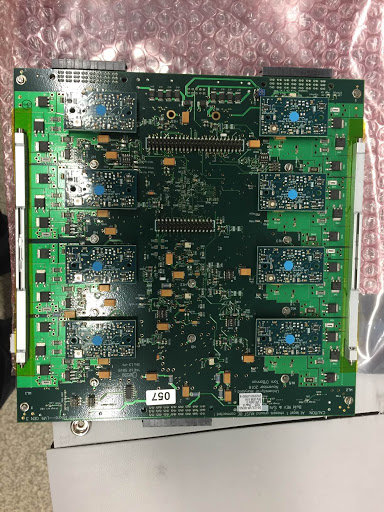

## Setup

Make sure you are grounded. Visually inspect the LVR for any damage. You will need the following items:

- LVR
- LVR Baseplate
- Wedge Locks
- 8mm flat head (not countersunk) {==M2.5==} screws
- {==M2.5==} washers
- 5mm {==M2==} screws
- Thermal gap filler strips
- Thermal paste (GL-20-10 for now)
- Kapton Tape
- Punch
- Screwdrivers

## Continuity check

Measure the resistance between any of the grounds (for example ground pins of the input/output connectors) and the aluminum backplate.
The resistance should be on the order of 100k ohms to ensure the backplate is not
electrically connected to the LVR.

## Wedge Locks

1. Put a strip of kapton along the edges of the CCM side of the board.
2. Poke holes for the wedge lock screws with a punch.
3. Attach the wedgelocks

    !!! danger "IMPORTANT"
        The side that can be adjusted with an alan key needs to face the LVR
        outputs (two big connectors)).

4. Attach each wedgelock with 2 {==M2==} screws.

    !!! note
        I put the wedge locks on last. It should be much easier to do them
        first, but I don't have any pictures.

## Thermal gap filler

1. Remove one side of the plastic backing and press the gap filler strip on to
   the exposed metal on the LHC4913 side of the board, aligning the screw
   holes. Then remove the plastic backing from the other side.  Repeat for the
   other side of the board.

    

2. Put the applicator flush with the top of an LHC4913 chip, gently push the plunger, and spread
   some paste on the chip.  Very little paste is needed, and only covering the metal heat sink.  See
   above picture for approximate thickness.  Repeat for all 10 chips.

    

## Baseplate

1. Place the baseplate on the LHC4913 side of the LVR. Make sure the baseplate
   is aligned so that the raised squares with threaded holes match the holes on
   the LVR.  Also check that all corners are aligned.

    

2. Put an {==M2.5==} screw and washer in each hole.  First tighten very gently, then
   make hand tight in an X pattern across the board.  For your first few boards, try to look between the
   LVR and baseplate to see that the thermal paste has made contact with the
   baseplate and been deformed.  Not all chips can be verified this way.

    
    
3. Put a number sticker on the baseplate matching the number on the front of the LVR.  Make sure to use the roll labeled for LVRs.

## CCMs

Attach 8 CCMs, matching the color of the stickers on the LVR.  Make sure to orient the CCMs correctly (see picture)

## Final

1. Repeat the continuity check above to ensure that the LHC4913 chips have not made contact with the baseplate during assembly.

2. Put a post-it note on the ESD bag matching the color of the CCM stickers, and put the LVR in the box for burn-in.

3. Update the database, you have assembled an LVR!

