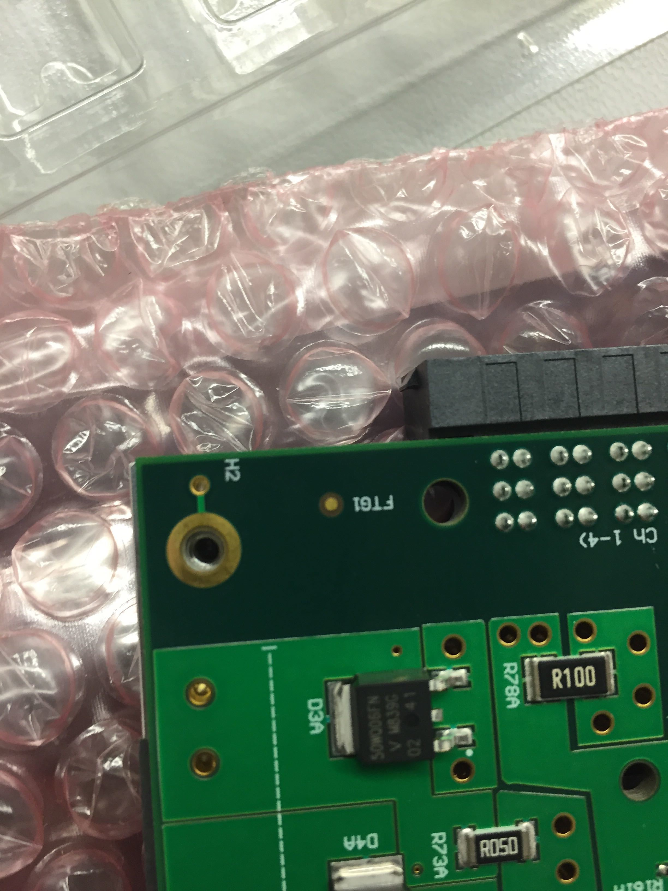

## Setup

Make sure you are grounded. Visually inspect the LVR for any damage. You will need the following items:

- LVR
- LVR Baseplate
- Wedge Locks
- 8mm flat head (not countersunk) {==M2.5==} screws
- {==M2.5==} washers
- 5mm {==M2==} screws
- Thermal gap filler strips
- Thermal paste (GL-20-10 for now)
- Kapton Tape
- Punch
- Screwdrivers

## Wedge Locks

It is not clear to me if Kapton tape is needed to prevent the wedge lock from
abrading the solder mask, so I include the step for now.

1. Put a strip of kapton along the edges of the CCM side of the board.
2. Poke holes for the wedge lock screws with a punch.
3. Attach the wedgelocks

    !!! danger "IMPORTANT"
        The side that can be adjusted with an alan key needs to face the LVR
        outputs (two big connectors)).

4. Attach each wedgelock with 2 {==M2==} screws.

    !!! note
        I put the wedge locks on last. It should be much easier to do them
        first, but I don't have any pictures.

## Thermal gap filler

1. Remove one side of the plastic backing and press the gap filler strip on to
   the exposed metal on the LHC4913 side of the board, aligning the screw
   holes. Then remove the plastic backing from the other side.  Repeat for the
   other side of the board.

    

2. Put the applicator on an LHC4913 chip, gently push the plunger, and spread
   some paste on the chip.  Only the metal heat sink needs to be covered.  See
   above picture for approximate thickness.  Repeat for all 10 chips.

    

## Baseplate

1. Place the baseplate on the LHC4913 side of the LVR. Make sure the baseplate
   is aligned so that the raised squares with threaded holes match the holes on
   the LVR.  Also check that all corners are aligned.

    

2. Put an {==M2.5==} screw and washer in each hole.  First tighten very gently, then
   make hand tight in an X pattern across the board.  Try to look between the
   LVR and baseplate to see that the thermal paste has made contact with the
   baseplate and been deformed.  Not all chips can be verified this way.

    

3. Update the database, you have assembled an LVR!

    

## Continuity check

Measure the resistance between any of the grounds and the aluminum backplate.
The resistance should be very large to ensure the backplate is not
electronically connected to the LVR.
