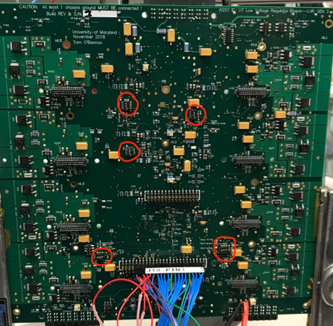

QA Procedure
============

Note the following before beginning QA procedures:

1.  Beware that TP5 is *not* GND. The silkscreen label applies to the adjacent
    TP2.

2.  Fused power input breakout board silk screen circuit labels are incorrect.

3.  The LVR outputs should be connected to a benign load that can withstand
    having upwards of 7v output. (ie the LVR channel outputs follow the input
    power rail if the CCM is not populated and configured.)

4.  Extreme caution is needed when connecting test lead clips to the test
    points.

    1.  The test points are rather fragile and easily pulled of the board.

    2.  Care must be taken to avoid temporary unintended shorts from the high
        density of surrounding components, via’s, and traces.

5.  When configuring the CCMs on the LVR, remember that CCM voltage types split
    down the middle of the LVR (i.e. CH1-4 must have the same CCM voltage, CH5-8
    must have the same CCM voltage)

6.  Going down the board on one side, arrange CCMs as master, slave, master,
    slave, etc.

7.  The Master-Slave configurations require a jumper ON the LVR output breakout
    board that electrically connects the master and slave output rails together.

Full QA Procedure:

1.  Note Serial Number of LVR and CCM before beginning QA

2.  Verify that the chassis and power ground are isolated \> 25K Ohms.

    1.  Meter lead Polarity ‘A’

    2.  Meter lead Polarity ‘B’

3.  Set power supply initially to 1.6 V and the current limited to 1.5 A

4.  Connect up power with any number of channels (ideally since all channels are
    being tested you should put fuses in all slots, however in principal it does
    not matter which channel you select)

    1.  Verify voltage polarity of connections

5.  Place a DVM (DC Voltage Meter) between TP3 (3.3V) and TP6 (GND) to monitor
    the 3.3v rail

6.  Place another DVM between TP8 (1.5V) and TP6 (GND) to monitor the 1.5v rail

>   Note you can also use the LVR monitor for this section, looking at the
>   Vin_FPGA_3V3 and Vin_FPGA_1V5 readings

1.  Slowly increase the input voltage from the initial 1.6V to a max of 4.5V
    while monitoring the 3.3v and 1.5v rails to make sure they stay below the
    max values. STOP IF VALUES BELOW ARE EXCEEDED to prevent damage.

    1.  1.5V x 110% = 1.65V

    2.  3.3V x 110% = 3.63V

2.  Verify that the input voltage is now set to 4.5 v

3.  Adjust p1 to obtain 1.50 v on TP8.

4.  Adjust p2 to obtain 3.3v on TP3.

5.  Re-verify both the 3.3v and 1.5v rails are correct. σV should be at most
    0.01 V.

6.  Record input current

1.  Place a DVM between TP4 (Vop_rail) and TP7 (GND)

2.  Slowly increase the input voltage to 7V until EITHER the Vop_rail stops
    increasing or hits 5.5V.

    1.  **IT IS IMPERATIVE THAT THE Vop_rail NOT EXCEED 5.5V !!!!**

    2.  Adjust P5 whilst increasing the input voltage

    3.  The Vop_rail will clamp at a maximum of 5.5V when properly adjusted.

3.  PROGRAM THE FPGA

4.  Turn power off

5.  Connect jumpers between J22 pins 2 & 4 (V_pump) and between J22 pins 1 & 3
    (V_jtag)

6.  Connect programmer to J17.

7.  Turn power on

8.  Initiate the program sequence

    1.  If no program has been loaded onto the FPGA, go to Open Project

    2.  Inside the LVR folder select the program you want to run

    3.  Go to Configure Device

    4.  Click Browse, and select the .pdb file you wish to use to program

    5.  Set MODE to basic, and set ACTION to program

    6.  Once that is complete, click PROGRAM

9.  Record checksum when program is done

    1.  Checksum = \______\_

10. Move jumpers on J22 to connect pins 4&6 and pins 3&5

1.  Set dip switch configuration for undervoltage lockout and overtemp lockout

    1.  Locate dip switches SW6[A,B,C,D]. Note the side of the switch body
        labeled ON.

        1.  Set the 3rd switch to ON. Leave others OFF

    2.  Locate the switch labeled SW1

        1.  Set the 4th switch to ON. Leave others OFF

    3.  Locate the switches on the back of the regulator (SW2-5)

        1.  Set SW5 to [OFF, OFF, OFF, OFF]

        2.  For SW4, for each channel pair that has a master-slave pair, set
            each corresponding pin to OFF if a slave is present in the channel
            pair, otherwise set to ON

            1.  1 -\> CH1+2, 2 -\> CH3+4, 3 -\> CH5+6, 4 -\> CH7+8

        3.  Set SW2 and 3 to [OFF, OFF, OFF, OFF]

    4.  Note that the ON position is labelled opposite the numbered slots (1, 2,
        3, 4)

    5.  Additionally, note that if you wish the board to be in pulsed duty
        cycle, set SW3 pin 1 to OFF, otherwise keep pin at ON

1.  Undervoltage Lockout test

    1.  Locate SW6[A, B, C, D]

        1.  SW6A -\> CH7 + CH8

        2.  SW6B -\> CH5 + CH6

        3.  SW6C -\> CH3 + CH4

        4.  SW6D -\> CH1 + CH2

    2.  For each SW6\#, verify that its corresponding channels shut off when
        turning the switch configuration to [OFF, OFF, OFF, OFF]

    3.  Each channel should switch from some voltage (depending on power supply
        setting) to \____\_ (0V in principle)

2.  Overtemperature lockout test

3.  Locate SW1

4.  Set SW1 to [ON, ON, ON, ON]

    1.  This tells the board to lockout at room temperature

5.  Locate LD7 (bottom left corner of LVR)

6.  Verify LD7 is ON

7.  Adjust the Voltage offsets at the following TP pairs using the following
    variable resistors

    1.  CH 4 to 1: TP9 (Vos_gen) and TP10(GND)

    2.  CH 8 to 5: TP14 (Vos_gen) and TP15(GND)

    3.  Adjust P3 and P4 on each respective side of the board in order to
        configure the voltages.

8.  EACH 4-channel group must be set to operate with the same output voltage as
    shown below:

    Vos Vout

    -   1.775V 2.5V case

    -   1.546V 1.5V case

    -   1.483V 1.225V case

9.  Use the RJ45 breakout board to perform the sense line test

10. Verify that the peak voltage goes it RAIL when the following sense lines are
    shorted to each other. Recall that on the respective ethernet connectors:

    1.  CH1 & CH5 are pins 1&2,

    2.  CH2 & CH6 are pins 4&5

    3.  CH3 & CH7 are pins 3&6

    4.  CH4 & CH8 are pins 7&8

11. Set SW2 1st switch to ON (takes regulator out of pulsed mode so we don’t
    forget for slice test)
