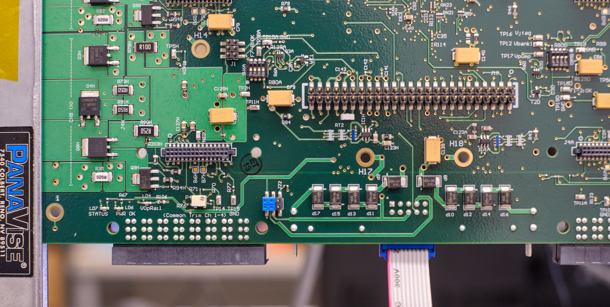
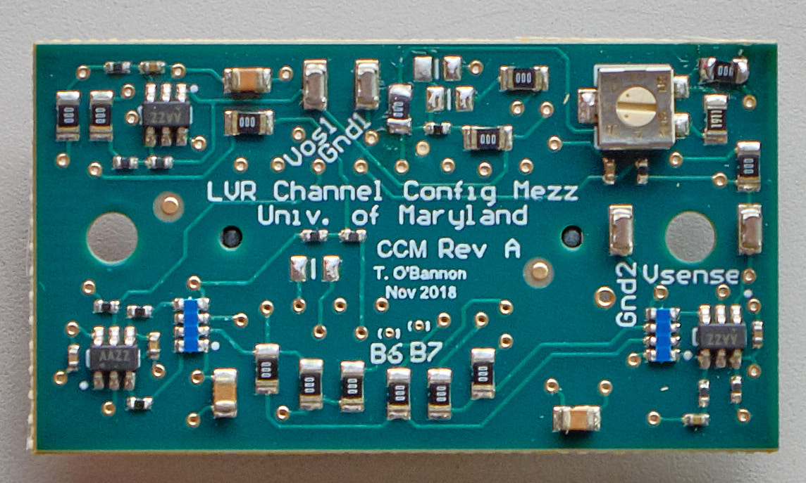
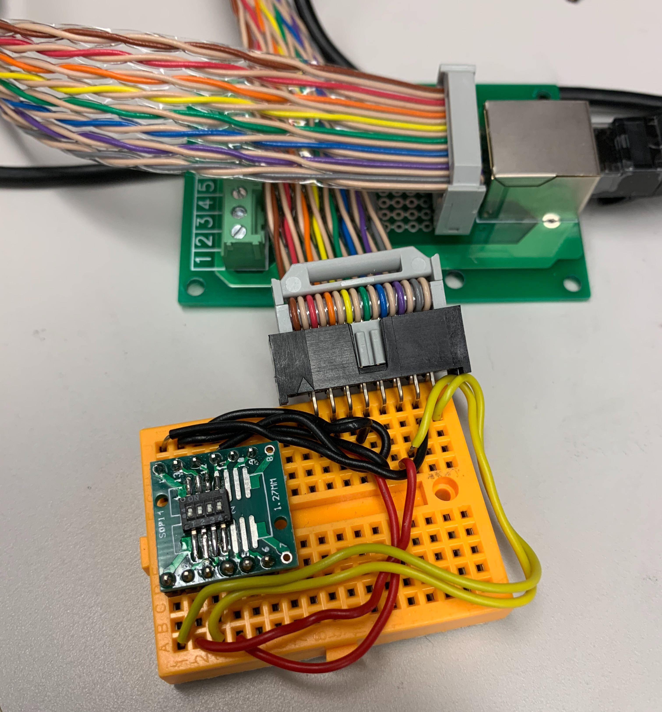

!!! info "Before you proceed"

    - Beware that **`TP5`** is **NOT** GND. The silkscreen label applies to
      the adjacent **`TP2`**.

    - Caution is needed when connecting test lead clips to the
      test points. The test points are rather fragile and easily pulled of the board.

    - Care must be taken to avoid temporary unintended shorts from the high
      density of surrounding components, vias, and traces.

1. Visually inspect a new LVR and place it on the holder as shown in the picture. The CCM side should be facing you and the input
connector be at the top. Recall that the one input is on one end and the two outputs on the other.
  
  
2. Set dip switch configuration for undervoltage lockout and overtemp lockout (`ON` or `1` is setting the toggle
toward the side that has **ON** printed on the switch)
  
  
    | Type | SW1 (CCM) | SW3 (FPGA) | SW2 (FPGA) | SW5 (FPGA) |
    |------|-----|-----|-----|-----|
    | All LVRs | `0001` | `1111` |  `1111` |  `1000`  |

    | Type | SW6[ABCD] (CCM) | SW4 (FPGA) |
    |---|-----|----|
    | 12A | `1010` |  `0000`  |
    | 15MS | `1100` |  `1111`  |
    | 25A | `1000` |  `0000`  |

3. Place an serial number sticker on a new LVR under the input connector, and document its serial number in the
[database](https://docs.google.com/spreadsheets/d/1KjXGhOFzi0SZPsozpKzxGjVtfr4kkS_Hv5EigUwKOj8/edit#gid=1564410083). Also document which type of LVR you intend to QA (12MS, 12A, 12MSA, 15MS, 25A). 

    - You don't need to fill every column in the database as you complete that test until you finish the QA
    or leave the setup for any reason.
    - The CCM serial number is documented at a later stage, during LVR assembly.

4. Verify that the chassis and power ground are isolated by \> 25k Ohms (often 180k Ohms)
    1. Measure the resistance between the lugs sticking out near the input connector and any `GND` test point
    on the board (eg. **`TP7`**)
    2. Repeat measurement reversing the polarity of leads (ground isolation circuit is different each way)

5. Connect jumpers between **`J22`** (near ch8) pins 2 & 4 (`V_pump`) and between `J22` pins 1 & 3 (`V_jtag`).
You can zoom in the above picture (righ-click, view image) to check it. This
configuration allows you to program the FPGA later on.

6. Connect the raspberry Pi LVR monitor to the board, and activate the LVR monitor on the laptop if it is
not already running. If not using the Pi, you can follow the instructions at the bottom of the page.
    1. Go to PuTTY and select Monitor Pi
    2. Both user name and password are "`lvr`"

7. Set the power supply initially to 1.6V and the current limited to 2.0A, and connect provided input breakout board.
Verify polarity of connections visually
    1. Red wire in positive terminal of power supply
    2. Blue wire in negative terminal
    3. Negative terminal ground shorted
    4. Turn power supply on and enable output

8. Adjust the `P1`, `P2`, and `P5` potentiometers so that the 1.5V, 3.3V, and 5.5V rails (voltage plateaus) are
set to those values.
    1. Slowly increase the input voltage from the initial 1.6V until either the 1.5V reading (`Vin_FPGA_1V5`) stops increasing or
    exceeds 1.5V. At this point, tune the output using P1 to set it to 1.5V. You may have to increase the voltage
    more and iterate the tuning process. An alternate approach is given in the tip below.
    
    2. Resume raising the input voltage and repeat this process on the 3.3V (`Vin_FPGA_3V3`) and 5.5V (`V_OPAMP_RAIL`) 
    levels in the Pi LVR monitor. You should now be able to raise the input voltage all the way to 7V and the three readings
    should be stable.
    
    !!! warning
        **STOP IF VALUES BELOW ARE EXCEEDED** to prevent damage.

        - 1.5V x 110% = 1.65V
        - 3.3V x 110% = 3.63V
        - **The 5.5V rail (`Vop_rail`) should not exceed 5.5V!!**
        
        When the power supply reaches about 4.5V, the expected input current given by the supply at this point
        should be around 0.09A. If it is substantially more there may be a problem

    !!! tip    
        It may be useful to let the rail approach the desired value from below as input voltage increases,
        then turn down the rail plateau to a value below the desired final plateau, and make the final
        adjustments by turning the input voltage and rail plateau values up simultaneously. Note that you can
        verify the rail has reached its plateau if you increase the input voltage and the rail voltage no
        longer increases.

    !!! info "Desired values"
        - The 1.5V and 3.3V rails should be set to within 0.01V if possible.
        - The 5.5V rail works in the 5.0-5.5V range, with a
        preference to be in the range 5.45-5.5V, as this allows for a slightly better time response.

9. Output standby configuration. Adjust the voltage offsets at the
    following test point pairs using the following potentiometers, using a multimeter to read the DC voltage.

    - CH 4-1: **`TP9`** (`Vos_gen`) and **`TP10`** (GND)
    - CH 8-5: **`TP14`** (`Vos_gen`) and **`TP15`** (GND)

    Adjust P3 and P4 on each respective side of the board in order
    to configure the voltages. (They are beside the testpoints)

    !!! note
        Each 4-channel group must be set to operate with the same output
        voltage according to what kind of CCM it will host as shown below (within a few mV):

        | Vos [V] | Vccm [V] |
        |---------|----------|
        | 1.775   | 2.5      |
        | 1.546   | 1.5      |
        | 1.483   | 1.225    |

10. Program the FPGA
    1. Turn power off
    3. Connect programmer to **`J17`** on the back of the board, bottom-center (the ribbon in the picture
    below). Also make sure the blue jumpers are place in `J22` as in the picture.
   {: style="height:300px"}
   4. Turn power on (7V is still fine)
    5. Initiate the program sequence, opening FlashPro on the laptop if is not already running
        1. If no program has been loaded onto the FPGA, go to Open Project and select the pre-loaded
        program in the LVR folder you want to run
        2. Go to Configure Device
        3. Click Browse, and select the file v2-06_lvr_fw.stp
        4. Set **MODE** to basic (should be default), and set **ACTION** to program
        5. Once that is complete, click **PROGRAM**
    6. Check in the log that the auto-verify ran successfully (`RUN PASSED` in green).

11. Turn off power and install all 8 CCMs in the orientation that allows you to read the silkscreen as shown below.
Remove the Raspberry Pi connector to install those.
  {: style="height:200px"}
    - For an `MS` type LVR, set up master CCMs on odd channels, slaves on even.
    - For an `A` type LVR, place stand-alone single master (`A`) CCMs on all channels.
    - For `MSA` type, fill half the channels with `MS` (CH1-4 for instance) and half with `A` CCMs.

12. Undervoltage Lockout test
    1. Set input power to ~4.8V, connect raspberry Pi LVR monitor and turn power on
    2. Reduce the input power gradually, and confirm that the outputs shut off (go to ~0V) below
       4.5-4.6 volts (ish). After confirming this, turn the input power back to ~4.8V so that the outputs are on for the next test.

    !!! info
        To test individual undervoltage lockouts (if needed) use the following procedure

        1. Locate SW6\[A, B, C, D\]. The switcher-channel correspondence is given in the table below

        2. For each SW6\#, verify that its corresponding channels shut off
           when turning the switch configuration to \[**OFF, OFF, OFF, OFF**\]

        3. Each channel should switch from some voltage (depending on power
           supply setting) to ~0V.

        | SW6 switcher | Channels |
        |--------------|----------|
        | SW6A         | CH7 & 8  |
        | SW6B         | CH5 & 6  |
        | SW6C         | CH3 & 4  |
        | SW6D         | CH1 & 2  |
        
    
    !!! note
        The output voltages in each channel will be slightly higher than that of the
        CCM voltage. 25 CCMs output ~2.7V, 15 output ~1.7 V, 12 output ~1.4 V

11. Overtemperature lockout test
    1. Locate SW1.
    2. Set SW1 to \[**ON, ON, ON, ON**\].

        !!! info
            This tells the board that it should shut down if it gets above ~ 20C (room temperature). You actually may already see overtemperature lockout occur when SW1 is
            set to \[**OFF, OFF, ON, ON**\], but still, perform this test by setting SW1 to \[**ON, ON, ON, ON**\].

    3. Locate **`LD7`** (bottom left corner of LVR).
    4. Verify **`LD7`** is `ON`.
    5. Verify all `V_OUT` channel values as shown on monitor go to ~0V.
    6. Set SW1 back to nominal \[**OFF, OFF, OFF, ON**\]

12. Use the RJ45 breakout board to perform the sense line test.
    Verify that the voltage of a channel goes to RAIL when the corresponding sense
    lines are shorted to each other. The sense lines are mapped to the RJ45 as follows:
    {: style="height:240px"}
  
    | Channels         | Pins  | RJ45 Connector |
    |------------------|-------|----------------|
    | CH1              | 1 & 2 | Right (J10)    |
    | CH2 (if 12/25A)  | 4 & 5 | Right (J10)    |
    | CH3              | 3 & 6 | Right (J10)    |
    | CH4 (if 12/25A)  | 7 & 8 | Right (J10)    |
    | CH5              | 1 & 2 | Left  (J16)    |
    | CH6 (if 12/25A)  | 4 & 5 | Left  (J16)    |
    | CH7              | 3 & 6 | Left  (J16)    |
    | CH8 (if 12/25A)  | 7 & 8 | Left  (J16)    |

    !!! note
        Slave channels will not alter voltage when shorting those channels.
        They will only go to RAIL when shorting their respective master channels.

13. SPI Communication test
    1. On the laptop's desktop, locate the "SPI test". Run this shortcut.
    2. The username and password are both 'spitest'
    3. You will see a menu for options to send commands to the LVR. Try requesting the LVR status (first option) and verify that the response ends in 0xFFFF (all 
    channels on). You can also request WORD2, which should end with 0x203 (the FW version) and try modifying the config to turn all the channels OFF and ON again.
    4. When you are satisfied the LVR is responding properly, connect the SPI_RESET line (floating green wire) to any GND test point on the LVR
       (the GND on the raspberry pi or the Rigol power supply also works in principle). The LVR should stop replying and
       you should read the response as all 00 00 00 00 no matter the command you send until you allow the SPI_RESET to float once more.

14. If it is not already, set SW5 2^nd^ switch to **OFF** (takes regulator out of pulsed mode).
15. Switch off the power and disconnect everything from the board (excluding the jumpers placed on **`J22`**), and place colored stickers on the board near the CCM connectors to indicate which
CCMs were used on the board during the QA.

19. Make sure you update the
[database](https://docs.google.com/spreadsheets/d/1KjXGhOFzi0SZPsozpKzxGjVtfr4kkS_Hv5EigUwKOj8/edit#gid=1564410083)
appropriately. **You're done!**

### If not using the raspberry Pi LVR monitor
Place a DVM (DC Voltage Meter) between **`TP3`**
(3.3V) and **`TP6`** (GND) to monitor the 3.3V rail, another DVM between **`TP8`** (1.5V) and **`TP6`**
(GND) to monitor the 1.5V rail, and a third DVM between **`TP4`** (`Vop_rail`) and **`TP7`** (GND) to
monitor the op amp rail. The first image below shows the location of **`TP3`**, **`TP6`**, and **`TP8`**,
as well as potentiometers **`P1`** and **`P2`** that will be used to adjust the 1.5V and 3.3V rails. The
second image shows the locations of **`TP4`**, **`TP7`**, and **`P5`** for the op amp rail.

