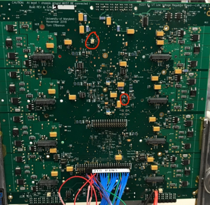
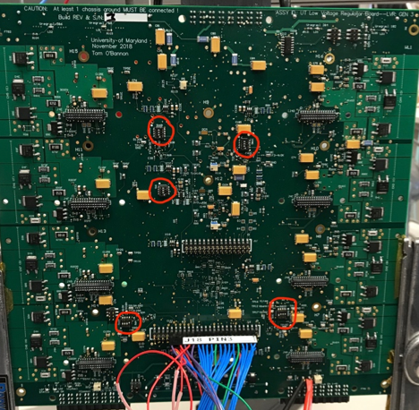

!!! info "Before you proceed"

    - Beware that **`TP5`** is **NOT** GND. The silkscreen label applies to
      the adjacent **`TP2`**.

    - Fused power input breakout board silk screen circuit labels are
      incorrect.

    - ??? The LVR outputs should be connected to a benign load that can withstand
      having upwards of 7V output. (i.e. the LVR channel outputs follow the input
      power rail if the CCM is not populated and configured.)

    - Caution is needed when connecting test lead clips to the
      test points. The test points are rather fragile and easily pulled of the board.

    - Care must be taken to avoid temporary unintended shorts from the high
      density of surrounding components, via's, and traces.

    - When configuring the CCMs on the LVR, remember that CCM voltage
      types split down the middle of the LVR (i.e. CH1-4 must have the same CCM
      voltage, CH5-8 must have the same CCM voltage)

    - ??? The Master-Slave configurations require a jumper ON the LVR output breakout
      board that electrically connects the master and slave output rails together.

1. Place an ID sticker on a new LVR under the input connector at the top on the side with the CCM connectors (recall there is one input on one end and two outputs on the other), and document its serial number in the database. Also document which type of LVR you intend to QA (12MS, 12A, 12MSA, 15MS, 25A).

    !!! note The CCM serial number is documented at a later stage, during LVR assembly.

2. Verify that the chassis and power ground are isolated \> 25k Ohms
    1. Measure input voltage at the large lugs near the outputs at the bottom of the board
    2. Use any GND test point on the board (eg. **`TP7`**)
    3. Repeat measurement reversing the polarity of leads (ground isolation circuit is different each way)

3. Set power supply initially to 1.6V and the current limited to 2.0A, and connect provided input breakout board. Verify polarity of connections visually
    1. Red wire in positive terminal of power supply
    2. Blue wire in negative terminal
    3. Negative terminal ground shorted

4. Turn power supply on. Connect the raspberry Pi LVR monitor to the board, and activate the LVR monitor on the laptop if it is not already running
    1. Go to PuTTY and select Monitor Pi
    2. Both user name and password are "`lvr`"

    !!! note If not using the raspberry Pi LVR monitor, place a DVM (DC Voltage Meter) between **`TP3`** (3.3V) and **`TP6`** (GND) to monitor the 3.3V rail,
    another DVM between **`TP8`** (1.5V) and **`TP6`** (GND) to monitor the 1.5V rail, and a third DVM between **`TP4`** (`Vop_rail`) and **`TP7`** (GND) to 
    monitor the 5.5V rail. The first image below shows the location of **`TP3`**, **`TP6`**, and **`TP8`**, as well as potentiometers **`P1`** and **`P2`**
    that will be used to adjust the 1.5V and 3.3V rails. The second image shows the locations of **`TP4`**, **`TP7`**, and **`P5`** for the 5.5V rail.
    
    
    
    

5. Slowly increase the input voltage from the initial 1.6V while monitoring the 1.5V, 3.3V, and 5.5V rails to make sure they stay below the max values (warning below).
Note that it is particularly important that the 5.5V rail not exceed 5.5V. As power is increased, the rails should near their desired value in the order: 1.5V, 3.3V,
5.5V. These rail voltages are achieved by adjusting a corresponding potentiometer (see tip below. Also see images above for potentiometer locations). After adjusting,
σV should be 0.01 V or less if possible.
    1. The 1.5V rail is adjusted using **`P1`** and can be read off the LVR monitor as `Vin_FPGA_1V5`
    2. The 3.3V rail is adjusted using **`P2`** and can be read off the LVR monitor as `Vin_FPGA_3V3`
    3. Increasing the power to around 4.5V, the expected input current given by the supply at this point should be around 0.09A. If it is substantially more there may
    be an issue. Both the 1.5V and 3.3V rails should be adjusted now and should no longer increase as the input voltage increases. Continue increasing the input voltage
    (up to a max of 7V while monitoring the 5.5V rail).
    4. The 5.5V rail is adjusted using **`P5`** and can be read off the LVR monitor as `V_OPAMP_RAIL` (this is the input voltage used to power op amps on the board and
    CCM's). This rail should no longer increase as you increase the input voltage to 7V.
    
    !!! warning
        **STOP IF VALUES BELOW ARE EXCEEDED** to prevent damage.

        - 1.5V x 110% = 1.65V
        - 3.3V x 110% = 3.63V
        - **The 5.5V rail (`Vop_rail`) should not exceed 5.5V!!**

    !!! tip
        It may be useful to let the rail approach the desired value, then turn down
        the setpoint to a value much below the current input voltage in order to find
        the plateau (max voltage where the rail 'sticks') more quickly

6. Program the FPGA
    1. Turn power off
    2. Connect jumpers between **`J22`** (near ch8) pins 2 & 4 (`V_pump`) and between `J22` pins 1 & 3 (`V_jtag`). You will have to disconnect the raspberry Pi LVR
    monitor for this.
    3. Connect programmer to **`J17`** (back of the board, center).
    4. Turn power on (7V is still fine)

    5. Initiate the program sequence, opening FlashPro on the laptop if is not already running
        1. If no program has been loaded onto the FPGA, go to Open Project and select the pre-loaded program in the LVR folder you want to run. Otherwise, continue
        2. Go to Configure Device
        3. Click Browse, and select the file v2-03_lvr_fw.stp
        4. Set **MODE** to basic (should be default), and set **ACTION** to program
        5. Once that is complete, click **PROGRAM**

    6. Check in the log that the auto-verify ran successfully.

7. Turn off power and install CCM's. For an MS type LVR, going down the board on one side, arrange CCM's as master, slave, master, slave, etc. with masters going on
odd channels, slaves on even

8. Set dip switch configuration for undervoltage lockout and overtemp lockout
    1. Locate four dip switches SW6\[A,B,C,D\]. Note the side of the switch
       body labeled ON.
       Set the 3^rd^ switch to **ON**. Leave others **OFF**. These switches (and SW1) are circled in the image below.

        

    2. Locate the switch labeled SW1. Set the 4^th^ switch to **ON**. Leave
       others **OFF**.

    3. Locate the switches on the back of the regulator, SW2-5 (circled in the image below)

        

        1. SW3 sets CH1-4 enabled. Set it to \[**ON, ON, ON, ON**\]
        2. SW2 sets CH5-8 enabled. Set it to \[**ON, ON, ON, ON**\]
        3. For SW4, for each channel pair that has a master-slave pair,
           set each corresponding pin to **ON** if a slave is present in
           the channel pair, otherwise set to **OFF**

            | SW4 switcher | Channels |
            |--------------|----------|
            | 1            | CH1 & 2  |
            | 2            | CH3 & 4  |
            | 3            | CH5 & 6  |
            | 4            | CH7 & 8  |

        4. Set SW5 to \[**ON, OFF, OFF, OFF**\] (channels come on immediately with power, output is constant rather than pulsed)

    4. Additionally, note that if you wish the board to be in pulsed
       duty cycle, set SW5 pin 2 to **ON**, otherwise keep pin at **OFF**.
       For most of the QA sequence it will be more useful in **OFF**

        

9. Undervoltage Lockout test
    1. Set input power to ~4.8 V and connect raspberry Pi LVR monitor
    2. Reduce the input power gradually, and confirm that the outputs shut off below
       4.5-4.6 volts (ish).

    !!! info
        To test individual undervoltage lockouts (if needed) use the following procedure

        1. Locate SW6\[A, B, C, D\]. The switcher-channel correspondence is given in the table below

        2. For each SW6\#, verify that its corresponding channels shut off
           when turning the switch configuration to \[**OFF, OFF, OFF, OFF**\]

        3. Each channel should switch from some voltage (depending on power
           supply setting) to ~0V.

        | SW6 switcher | Channels |
        |--------------|----------|
        | SW6A         | CH7 & 8  |
        | SW6B         | CH5 & 6  |
        | SW6C         | CH3 & 4  |
        | SW6D         | CH1 & 2  |

10. Overtemperature lockout test
    1. Locate SW1.
    2. Set SW1 to \[**ON, ON, ON, ON**\].

        !!! info
            This tells the board that it should shut down if it gets above ~ 20C (room temperature).

    3. Locate **`LD7`** (bottom left corner of LVR).
    4. Verify **`LD7`** is `ON`.
    5. Verify all `V_OUT` channel values as shown on monitor go to ~0V.
    6. Set SW1 back to nominal \[**OFF, OFF, OFF, ON**\]

    !!! note
        The output voltages in each channel will be slightly higher than that of the
        CCM voltage. 25 CCMs output ~2.7V, 15 output ~1.7 V, 12 output ~1.4 V

11. Output standby configuration. Adjust the Voltage offsets at the
    following test point pairs using the following variable resistors, using a multimeter to read the DC voltage.

    - CH 4-1: **`TP9`** (`Vos_gen`) and **`TP10`** (GND)
    - CH 8-5: **`TP14`** (`Vos_gen`) and **`TP15`** (GND)

    Adjust P3 and P4 on each respective side of the board in order
    to configure the voltages. (They are beside the testpoints. You can remove
    the nearby CCM if it gets in your way)

    !!! note
        Each 4-channel group must be set to operate with the same output
        voltage according to what kind of CCM it will host as shown below:

        | Vos [V] | Vccm [V] |
        |---------|----------|
        | 1.775   | 2.5      |
        | 1.546   | 1.5      |
        | 1.483   | 1.225    |

12. Use the RJ45 breakout board to perform the sense line test.
    Verify that the voltage of a channel goes to RAIL when the corresponding sense
    lines are shorted to each other. The sense lines are mapped to the RJ45 as follows:

    | Channels         | Pins  | RJ45 Connector |
    |------------------|-------|----------------|
    | CH1              | 1 & 2 | Right (J10)    |
    | CH2 (if 12/25A)  | 4 & 5 | Right (J10)    |
    | CH3              | 3 & 6 | Right (J10)    |
    | CH4 (if 12/25A)  | 7 & 8 | Right (J10)    |
    | CH5              | 1 & 2 | Left  (J16)    |
    | CH6 (if 12/25A)  | 4 & 5 | Left  (J16)    |
    | CH7              | 3 & 6 | Left  (J16)    |
    | CH8 (if 12/25A)  | 7 & 8 | Left  (J16)    |

    !!! note
        Slave channels will not alter voltage when shorting those channels.
        They will only go to RAIL when shorting their respective master channels.

13. SPI Communication test
    1. On the laptop's desktop, locate the "SPI test". Run this shortcut.
    2. The username and password are both 'spitest'
    3. You will see a menu for options to send commands to the LVR. Try requesting the LVR status (first option) and verify that the response ends in 0xFFFF. (All channels on)
       You can also request WORD2, which should end with 0x203 (the FW version) and try modifying the config to turn all the channels OFF and ON again.
    4. When you are satisfied the LVR is responding properly, connect the SPI_RESET line (floating green wire) to any GND test point on the LVR
       (the GND on the raspberry pi or the Rigol power supply also works in principle). The LVR should stop replying and
       you should read the response as all 00 00 00 00 no matter the command you send until you allow the SPI_RESET to float once more.

14. If it is not already, set SW5 2^nd^ switch to **OFF** (takes regulator out of pulsed mode).
15. Place colored stickers on the board near the CCM connectors to indicate which CCM's were used on the board during the QA. Disconnect everything from the board
(excluding the jumpers placed on **`J22`**).
