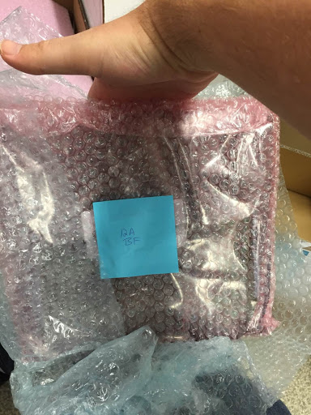
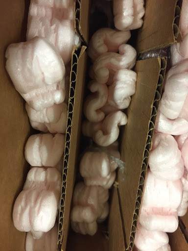
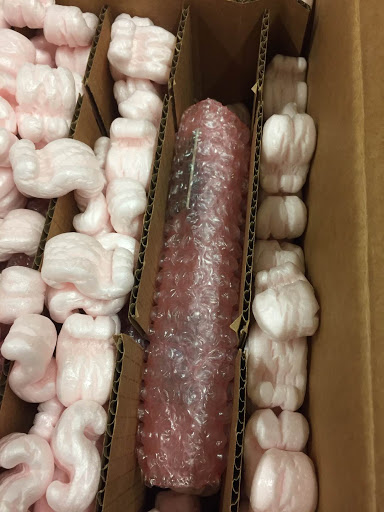
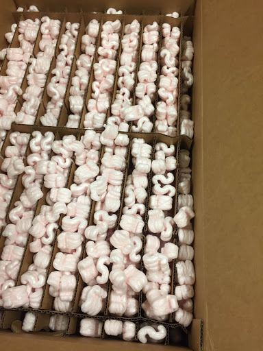
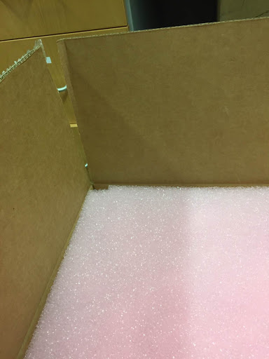

## Shipping procedure

Check the database and label the LVR box # according to the previously numbered LVR boxes.

As you pack LVRs check that their firmware is marked up to date in the database.  If so, note which box they are in.  If not, set them aside and check/program firmware before packing.

Remove the CCMs from the LVR if not done already.

Put the LVR in its ESD bag inside a pink bubble wrap bag.

Put the CCMs in pink bubble wrap as they arrived.

Wrap the LVR bag in an extra layer of bubble wrap from the LVR mechanics

Put the LVR in the box with a thin layer of styrofoam over it.

Put the CCMs for that LVR over the thing layer of styrofoam.

When all LVRs are packed cover everything thoroughly with styrofoam, making sure to get it in and around the honeycomb structure.

Put the pink foam on top of the styrofoam.  Make sure there is enough styrofoam that there is no gap between the pink foam and the top of the box.

Seal the box with tape.

