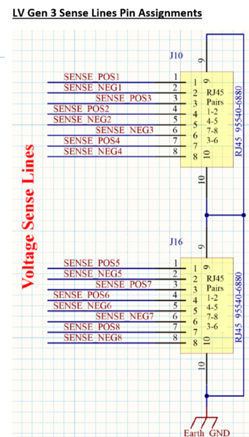
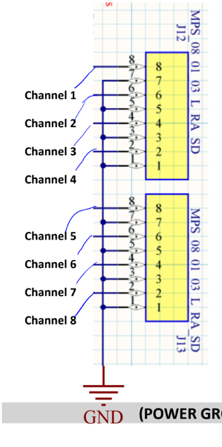

Abstract
========

The following serves as a guide for general LVR operation as well as LVR
QA procedures. The firmware loaded onto the LVRs by default does not
allow for channels to be directly controlled. When power is connected
the channels will come up in sequenced pairs (1-2, then 3-4, etc). It is
therefore important that you only bring up Vin if you are okay with
there being Vout. It is wise to first power up with the loads
disconnected and verify the polarity and amplitude of the outputs.
Beware doing this that if loads are disconnected from Vout but the sense
lines remain hooked up the output will just jump to 5V.

Channels should not be left at 5V output for a long time. There is a
resistor providing 220 Ohm minimal load, which is rated for 0.125W, but
would have to dissipate 0.11W. Therefore, channels with power but no CCM
should be set up as per "other unused channels" below, such that the
power through this resistor is negligible.

Channel Sense lines
===================

If RJ45 connections to the remote sense are unavailable (broken) the
regulators will fall back on a local sense mode and regulate the output
voltage at their connector instead. The sense line inputs follow RJ45
conventions:

-   CH1 & CH5 use pins 1&2,

-   CH2 & CH6 use pins 4&5,

-   CH3 & CH7 use pins 3&6,

-   CH4 & CH8 use pins 7&8

Setting Up Monitor/Programmer
=============================

This section deal with setting up the monitor/programmer for the LVR.

To set up the programmer:

a.  Turn power off

b.  Connect jumpers between J22 pins 2 & 4 (V\_pump)

c.  Connect jumpers between J22 pins 1 & 3 (V\_jtag)

d.  Connect programmer to J17.

e.  Turn power on

f.  Initiate the program sequence

g.  Move jumpers on J22 to connect pins 4&6 and pins 3&5

To set up the monitor:

a.  Connect Raspberry PI leads to J18. Note that leads must start at pin
    row 3-4, not 1-2

b.  Turn on raspberry PI and run code

c.  V\_SENSE refers to the output feedback voltage from the CCM

d.  V\_REGUL\_OUT refers to full input voltage

e.  i\_SENSE\_MON refers to current through resistor \_\_\_\_

Fuse/Channel Configuration
==========================

This section deals with which channels are being used. Ideally fuses
should be installed only for the channels to be used. Unfused is the
safest state for an unused channel.

The input BBs are mislabeled:

-   The fuse labeled F3-4 serves ch5+ch6, 

-   the fuse labeled F1-2 serves ch7+ch8, 

-   the fuse labeled F7-8 serves ch1+ch2,

-   the fuse labelled F5-6 serves ch3+ch4

Input voltage should be set above the UVL (Undervoltage lockout) setting
for that fuse group. As presently configured (pre-slice test) 5.5V
appears adequate for all configurations, but this is subject to further
study

Undervoltage lockout is configured via SW6A-SW6D (that is, one per fuse
group). This circuit disables the associated channels if the input
voltage falls below a threshold set by the switch. Within one SW4x, the
four toggles form a 3-digit number LSB-\>MSB, with the fourth toggle
putting the channel in an 'always on' state (override UVL).

It is best to be at least 0.25V, preferably 0.5V above the actual
drop-out voltage, otherwise a channel may appear to be on, but when it
actually tries to start the natural drop in Vin from the abrupt increase
in current demand by the regulator causes the UVL to trip, leading to a
series of false-start hiccups rather than actual starts.

Configuration of LVR
--------------------

LVR Configuration is done via the CCMs and the potentiometers P3 and P4,
which should be set according to the CCMs to be installed as

> Vos Vout

-   1.775V 2.5V case

-   1.546V 1.5V case

-   1.483V 1.225V case

P3 controls CH1-CH4, P4 controls CH5-CH8, and each group of four must
use the same CCM Vout. Vos may be measured across TP9-TP10 for CH1-4,
and TP14-15 for CH5-8

Normal versus Duty Cycle Mode
-----------------------------

For Low Duty Cycle Pulsed mode, we enable this via setting SW3-1 to OFF.
It provides a pulse every \~3 seconds that appears to last for \~60ms.
Normal mode (or continuous mode) provides continuous transmission of
voltage.

It is recommended that for operation periods greater than \~20 minutes
to have the board on Duty Cycle Pulsed mode (30-45 min in extreme
cases), whereas short operation periods can utilize continuous mode.
This is to prevent overheating of 4913ADLHC regulator chips on LVR.

Master/slave pairings
---------------------

Master slave pairs should ideally always be within a fuse group, and
must follow ascending channel number. That is, CH1 is M and CH2 is S, or
CH3 is M and CH4 is S, or CH5 is M and CH6 is S etc.

In addition to the appropriate CCM type, the firmware must be 'notified'
which channels are M+S pairs, via SW4. The "off" setting of the switch
corresponds to a M+S pair, while the "ON" state is the setting for two
single masters

-   SW4-1 corresponds to 1-2,

-   SW4-2 to 3-4,

-   SW4-3 to 5-6,

-   SW4-4 to 7-8

Note that when setting up master/slave CCM pairs, slave CCMs should
always be on even numbered CCMs.

Note: In the current firmware, SW5 contains enables for CH1-4, CH5-8 and a
global standby. To operate the regulator SW5 must be set as: (OFF, OFF,
ON, OFF)

Tom\'s notes on the configuration switches for the LVR, including
master/slave and general enables. **\*\*IMPORTANT\*\* THE CONVENTION
HERE IS OPPOSITE WHAT YOU EXPECT BECAUSE THESE ARE SHORTING PULL-UPS.
\"ON\" ON THE SWITCH IS LOGIC 0 AND \"OFF\" IS LOGIC 1.** Also please
note that the physical order is 3,2,4,5, and NOT 2,3,4,5

Note that LVR Configuration is done via the CCMs and the potentiometers
P3 and P4, which should be set according to the CCMs to be installed as

> Vos Vout

-   1.775V 2.5V case

-   1.546V 1.5V case

-   1.483V 1.225V case

P3 controls CH1-CH4, P4 controls CH5-CH8, and each group of four must
use the same CCM Vout. Vos may be measured across TP9-TP10 for CH1-4,
and TP14-15 for CH5-8.

Overtemperature/Undervoltage Lockout
------------------------------------

The overtemperature lockout is configured by SW1. SW1 represents a
binary number with switch 1 the LSB and switch 4 the MSB. Settings which
have been explored in the lab are (in big endian, LSB-\>MSB)

-   0101 -- regulator shuts off at 39C

-   1101 -- regulator shuts off at 30C

-   1001 -- regulator shuts off at 55C

-   0001 -- regulator shuts off at 70C

The slice test could easily run at either of the last two.

The undervoltage lockout is configured by SW6(A, B, C, D). We note the
following configurations for each SW6\#. Note that if 4 in SW6\#\[1, 2,
3, 4\] is ON, this acts as a bypass for all other switches. We therefore
only consider switcher 1-3:

\[0,0,0\] - 5.9 V

\[1,0,0\] - 5.4 V

\[0,1,0\] - 5.1 V

\[0,0,1\] - 4.6 V

\[1,1,0\] - 5.1 V

\[0,1,1\] - 4.1 V

\[1,1,1\] - 3.9 V

\[1,0,1\] - 4.6 V
