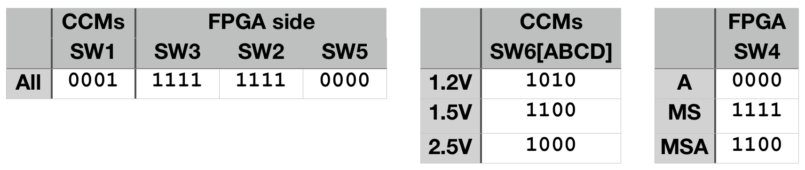

# Post-Burnin (final) QA Procedure

If you are already familiar with this procedure, you can simply follow the [LVR final QA checklist](LVR_final_QA_checklist.pdf).

!!! warning
    **You should not change the set up on the shelf with the oscilloscope and the loads.** All you'll need to change during final QA are
    
    - The connections to the LVR
    - In the case of `MS` boards, you'll need to add the jumper board to the MPSS black cables. It is easier to plug this board on the
    far end of the MPSS cable, and plug the other end of the MPSS cable directly to the LVR.

1. Put on the wrist strap, take a burned in LVR. **Set the switches** as indicated in the table below.
Order refers to toggles 1234 on the switch, with `1` meaning `ON`. (CCM) or (FPGA) refer to the side
of the LVR the switch is on. There are four SW6 switches, ABCD.
    

2. Confirm that the connection between `GND` (eg, `TP7`) and EARTH (lugs sticking out at the bottom) is still **\> 25k Ohms**
in both directions.

3. Slide LVR into the cooling frame, input side first. With the torque screwdriver set to 5.5 inch*pounds, tighten the
wedge locks.

4. **Connect** input BB, the Rpi monitor, and turn on the PS at 6V as shown below.
    - If fw version is not 2.06, also connect the Microsemi dongle, and update the firmware.

    

5. **Adjust `P1`, `P2`, and `P5`** if the base voltages are not as expected (`Vin_FPGA_1V5`=1.5 V, `Vin_FPGA_3V3`=3.3 V, `V_OPAMP_RAIL`=5.5 V)

6. Using the Rpi Butler software, request WORD2 to confirm **fw version is 2.06**, and **turn all channel `ON`**

7. Adjust the **CCM potentiometers** if the `V_SENSE_MONi` voltages are not about 1.25V, 1.52V, or 2.51V.

8. Reduce power supply voltage to about 4.3V (1.2V LVR), 4.8V (1.5V LVR), or 5.3V (2.5V LVR) and check the **under-voltage lockout (UVL) turns all channels off**
in the Rpi monitor.
    - Set input voltage back to 6V
    
9. Change SW1 to `0011`, and check the **over-temperature protection turns all channels off** and the `LD7` LED turns on. Some times you may have to go all the way to `1111`.

10. Set all channels to `READY` with the Rpi Butler, and **adjust `P3` and `P4`** if the `V_SENSE_MONi` voltages are between 110-190 mV (preferably 120-140 mV).

11. Repeat these steps after setting all channels to `OFF` with the Rpi Butler and connecting the MPSS cable and RJ45 sense lines to each output. For `MS` LVRs, you will need to connect the jumper board to the MPSS cable (easier on the end away from the LVR):
    1. Set the oscilloscope trigger to *Single*, the Butler to "Ripple ALL", and **check that the turn-on curve is smooth** and comes to a sensible voltage (scope is single ended,
    so voltage will be higher than `V_SENSE_MONi`). LVRs without slaves would look like on the left, `MS` like on the right.
    
    2. Confirm with multimeter that the **voltage drops across resistors `R73[A-H]` and `R91[A-H]` for each channel match one-another to within 2-5%**. These
    are the two medium-sized resistors with R050 and R150 printed on them.  It is okay if the values do not match between different channels.
    3. Check the sense lines by verifying that when the CAT5 cable is disconnected the
    `V_SENSE_MONi` for the connected channels **moves until it matches the other half of the LVR**.

12. Set the JTAG into a radiation-hard state by **moving the two jumpers on `J22`** (near ch8)
    to connect pins 4&6 and pins 3&5 (should be both jumpers moving one pin to the right if the
      output is facing you.)

13. The LVR can be shut down and set to its final configuration. Consult the database for
    valid 'sub types' and remove CCMS as necessary. For each removed CCM, one of the switches
    on SW3 and SW2 must be set off.

    | SW3 toggle | Channels | SW2 toggle | Channels |
    |--------------|----------|--------------|----------|
    | 1            | CH1      | 1            | CH5      |
    | 2            | CH3      | 2            | CH6      |
    | 3            | CH5      | 3            | CH7      |
    | 4            | CH7      | 4            | CH8      |

14. Update the [database](https://docs.google.com/spreadsheets/d/1KjXGhOFzi0SZPsozpKzxGjVtfr4kkS_Hv5EigUwKOj8/edit#gid=1564410083), and you are done!
