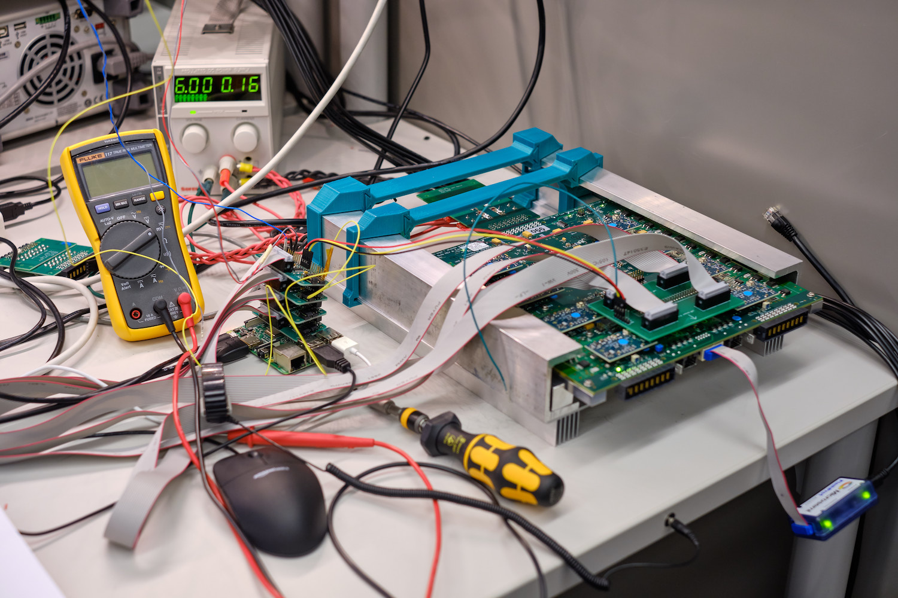
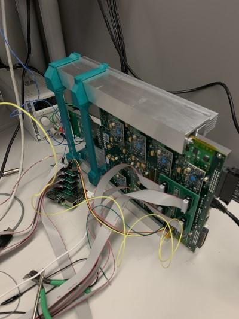
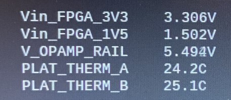
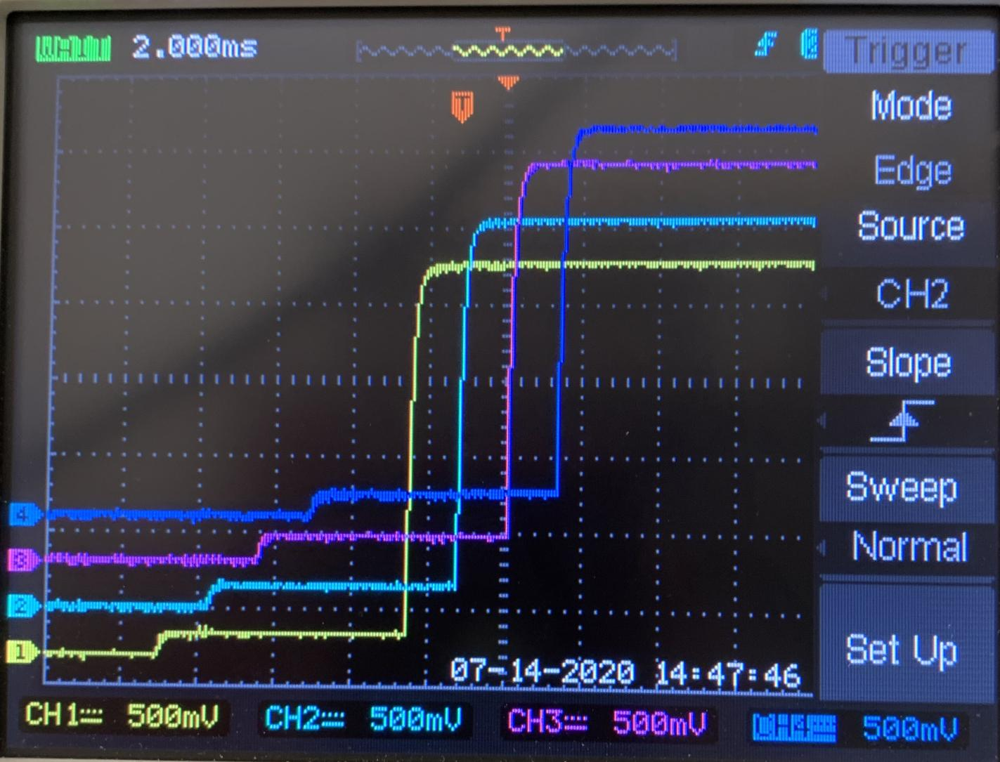

# Post-Burnin QA Proceedure

0. If the LVR was set up using the old firmware version, follow the steps in the initial QA to
   bring the FPGA to version 2.03.

1. Using a DVM, confirm that the connection between GND and EARTH (between, e.g. **`TP7`**
   and the large lugs) each way is still \> 25k Ohms

    !!! warning
        Before attempting the next step, ensure the screwdriver torque setting is at "1"
        and no higher!

2. Set SW5 to \[**OFF, OFF, OFF, OFF**\] if it is not already. Carefully slide the
   board into the cooling frame, input side first.
   Using the power screwdriver, tighten the wedgeloks by screwing in the hex bolts
    - the screwdriver will hit a torque limit and stop turning. **DO NOT** attempt to
      tighten further
    - See figure for what this should look like
    

3. Connect input power supply and LVR monitor. Power on the board with at least 6V in and
   check that the housekeeping voltages are as expected (`Vin_FPGA_1V5`=1.5 V, `Vin_FPGA_3V3`=3.3 V, `V_OPAMP_RAIL`=5.5 V)
    - the figures below show the stand all connected and on its side (sometimes useful
      to manipulate SW2-SW5) and the relevant lines on the LVR monitor
   
   

4. Using the LVR Butler software, request WORD2 and confirm that the LVR firmware version
   is reported correctly (LSBs equal to 0x203, CRC confirmed okay)

5. Clear the oscilloscope screen by forcing a trigger. Connect the load board MPSS
   extension cable and the sense cable in the corresponding RJ45 and use the LVR Butler to command the LVR to power up all channels.
    - The Scope should trigger with a screen like the following. Ensure that the
      turn-on curve is smooth, comes to the correct voltage (1.25, 1.50, 2.50) within
      a few %, and has a prestart voltage in the 100mV - 200mV range.
    

6. Check the undervoltage lockout by dialing down the input voltage and verifying
   that the channels turn off. Bring back up the input voltage.

7. Check the sense lines by verifying that when the CAT5 cable is disconnected the
   V_OUT for the connected channels moves until it matches the other half of the LVR

8. Plug back in the sense lines and confirm with a DVM that the voltage drops across
   resistors R73 and R81 for each channel match one-another to within 2-5%. These
    are the two medium-sized resistors with R050 and R150 printed on them. Some variation
   with this range is expected and is related to the lower tolerance of a certain
  resistor network.

    !!! note
        It is okay if the values do not match between different channels.

9. Use the LVR butler to turn all channels **OFF** with the SPI. Move the cables and
  repeat steps 5, 6, 7, and 8 for the other output and sense connector on the LVR

10. Before turning off the channels a second time, confirm that the overtemperature lockout
    is working by setting SW1 to \[**ON, ON, ON, ON**\] and verifying that the outputs shut
    down.

11. Configure SW6 and SW1 to the final values.

12. The LVR can be shut down and set to its final configuration. Consult the database for
    valid 'sub types' and remove CCMS as necessary. For each removed CCM, one of the switches
    on SW3 and SW2 must be set off.

    | SW3 switcher | Channels ||| SW2 switcher | Channels |
    |--------------|----------|||--------------|----------|
    | 1            | CH1      ||| 1            | CH5      |
    | 2            | CH3      ||| 2            | CH6      |
    | 3            | CH5      ||| 3            | CH7      |
    | 4            | CH7      ||| 4            | CH8      |

13. Set the JTAG into a radiation-hard state by moving the two jumpers on **`J22`** (near ch8)
    to connect pins 4&6 and pins 3&5 (should be both jumpers moving one pin to the right if the
      output is facing you.)
