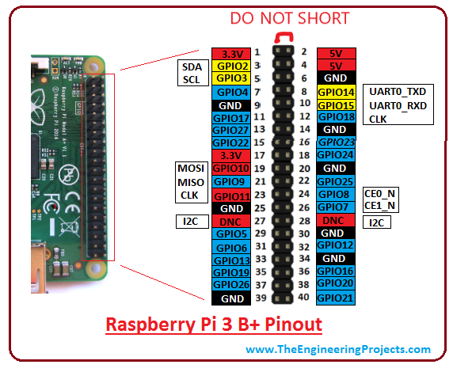
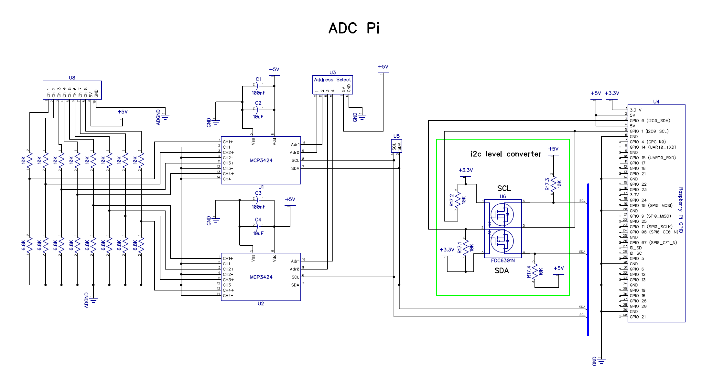
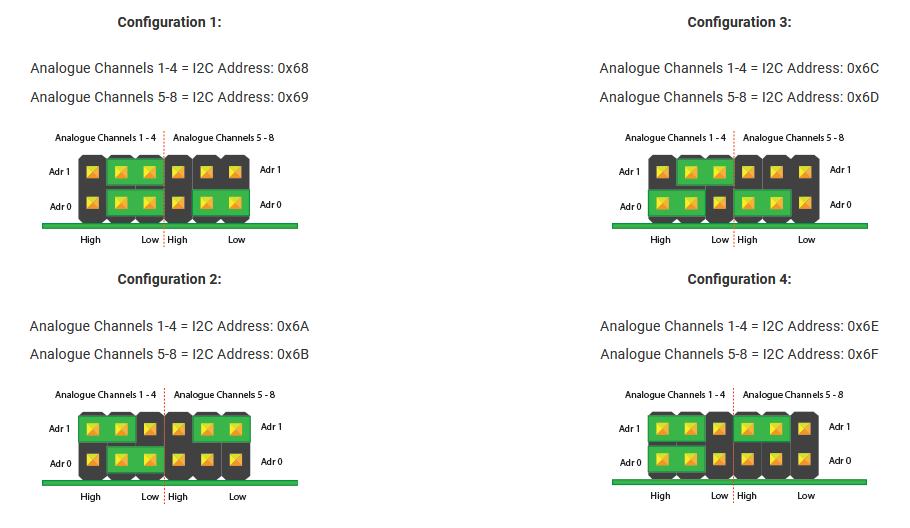

##LVR monitor general description
The Monitor as it presently exists consists of several pieces

1. Raspberry pi model "3 B+" or newer with 5V adapter
2. Interface (mouse/keyboard/monitor) for raspberry pi
3. 4x[ABElectronics ADC Pi](https://www.abelectronics.co.uk/p/69/adc-pi-raspberry-pi-analogue-to-digital-converter) with 0.1"-pitch shrouded right angle headers
4. One of:
    1. Custom built harness using 26-gauge stranded PTFE-insulated wire with CGRID-III crimp contacts housings
    2. LVR montior breakout PCB
5. Software based on the libraries available from ABElectronics with modifications by PMH for faster sampling of all 28 channels

###Raspberry pi pinout
Below is a pinout for the raspberry pi 3b+.

Pins of interest for the LVR testing are:
1. the SDA and SCL i2c lines, which talk to the ADC Pi expansion boards.
2. The 5V and 3V (as well as GND) pins used to power and permenently pull up Zishuo's load board for the final QA
3. Pins 19, 21, 23 used by the SPI interface

To use the i2c and SPI interfaces with the raspbian OS they must be enabled via `sudo raspi-config`. For SPI it is recommended that the pin20 ground be connected to the LVR as well if possible, though it is not strictly necessary if the LVR is not powering anything and the various system grounds are well-behaved.

### ADC Pi notes

[Click here for pdf schematic](schematic-adc-pi.pdf)

Mostly of note here is the fact that the inputs are run through a 10k/6.8k voltage divider. This means that *any resistance in series with the input changes the voltage divider, which must be corrected in software*. For example, if you measure a voltage on the LVR that has a 1k resistor before the pin, your measurement will be too low by a factor of 16,800/17,800 and you need to scale what the software gives you up to compensate.

The ADC boards each has one of several recommended i2c addresses, shown below. The physical order for the intial QA Rpi is Configuration 1 at the bottom closest to the Raspberry pi and then 2, 3, 4 moving up the stack, the final QA has the order reversed because oops.

In the LVR monitor python script, the following assignments are assumed:

|Configuration Number | Inputs |
|-------------|---------------|
| 1 | Housekeeping (3v3,1v5,V\_OP,temp) |
| 2 | V\_OUT |
| 3 | V\_SENSE |
| 4 | i\_MON outputs |

## LVR - pi interface
